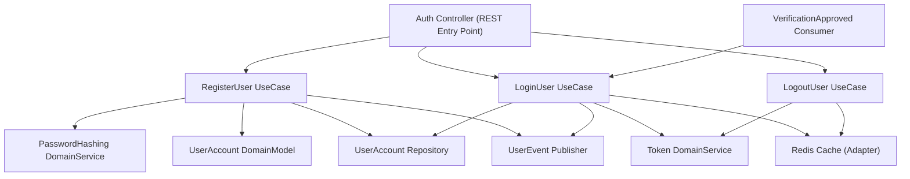
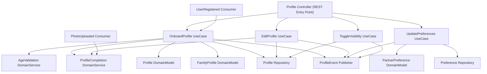
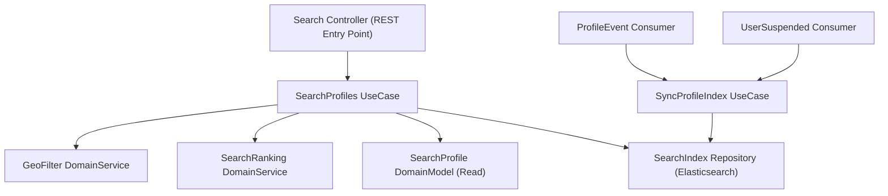
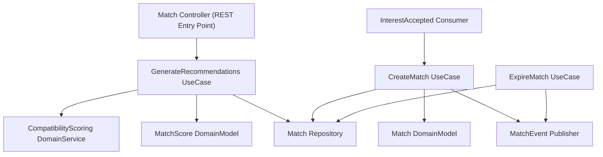
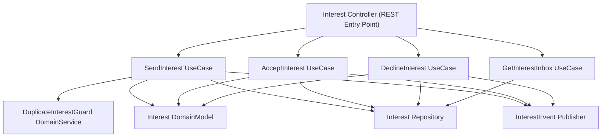
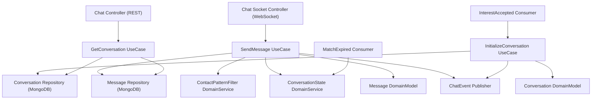
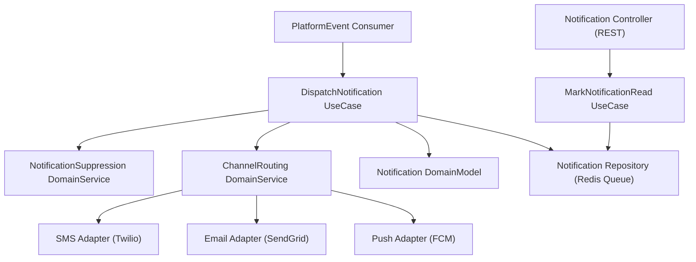
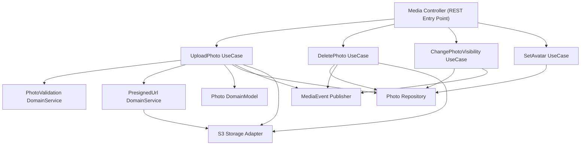
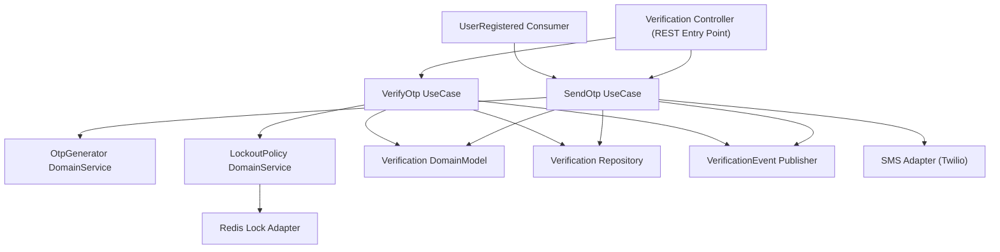
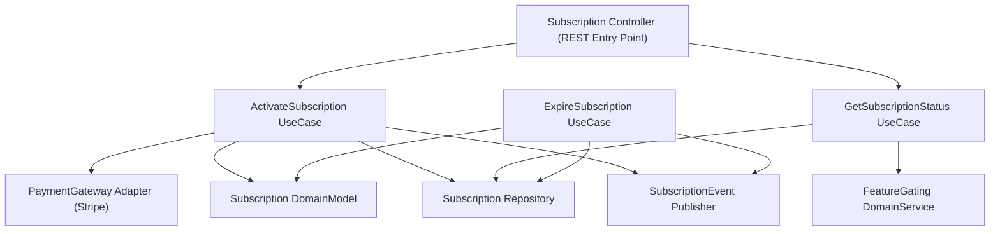

# Component Diagram — Matrimony Platform

This document decomposes each microservice into its internal logical components following **Clean Architecture** and **Domain-Driven Design (DDD)** principles. It defines component responsibilities, internal relationships, package structures, and renders a component diagram for each service.

---

## 1. Component Architecture Principles

### Clean Architecture Dependency Rule
Dependencies flow **inward only**. Outer layers depend on inner layers; inner layers never depend on outer layers:

```
Interfaces (Controllers, Event Consumers)
    ↓
Application Layer (Use Case Orchestrators)
    ↓
Domain Layer (Business Rules, Entities, Domain Services)
    ↓
Infrastructure Layer (Repositories, Adapters, Publishers)
```

### Domain-Driven Design Principles
- **Ubiquitous Language**: Component names use the same terminology defined in the Domain Model.
- **Aggregate Roots**: Repositories only expose operations on aggregate roots (e.g. `Profile`, `User`).
- **Domain Events**: Domain Services emit business facts that are published via Event Publishers.
- **Bounded Contexts**: Each service is a distinct Bounded Context with no shared logic.

### Standard Component Responsibilities

| Component Layer | Responsibility |
| :--- | :--- |
| **Controller** | Parse incoming request, validate inputs, delegate to Application Service, return response. |
| **Application Service** | Orchestrate business use cases. No business rules. Coordinates Domain Services and Repositories. |
| **Domain Service** | Stateless business logic spanning multiple domain models. |
| **Domain Model** | Core entity with identity, state, and behaviour rules. |
| **Repository** | Abstraction interface for persistence. Implements storage logic in Infrastructure. |
| **Event Publisher** | Converts domain outcomes into broker-published business events. |
| **Event Consumer** | Subscribes to external events and delegates to Application Services. |
| **External Adapter** | Thin wrapper isolating third-party SDK integration (SMS, S3, email, payments). |

### Standard Package Structure (Technology-Neutral)
```
/<service-name>/
  /domain/
    /models/          ← Core entity definitions
    /services/        ← Domain business logic
    /events/          ← Domain event definitions
  /application/
    /use-cases/       ← One class per user story action
    /dtos/            ← Input/output transfer objects
  /infrastructure/
    /repositories/    ← Concrete persistence implementations
    /adapters/        ← External third-party wrappers
    /publishers/      ← Event broker publishers
  /interfaces/
    /controllers/     ← REST/WebSocket entry points
    /consumers/       ← Message broker event consumers
```

---

## 2. Service Component Catalog

---

### 1. Auth Service

**Service Overview**: Manages all user identity operations — account registration, credential storage, session creation, and token lifecycle.

**Owned Domain Models**: `UserAccount`, `Session`

**Events Published**: `UserRegistered`, `UserLoggedIn`, `UserSuspended`

**Events Consumed**: `VerificationApproved` (activates account)

#### Internal Components

| Component | Name | Responsibility |
| :--- | :--- | :--- |
| **Controller** | `AuthController` | Receives registration and login requests. |
| **Application Service** | `RegisterUserUseCase` | Orchestrates account creation flow. |
| **Application Service** | `LoginUserUseCase` | Orchestrates OTP / magic link login flows. |
| **Application Service** | `LogoutUserUseCase` | Orchestrates session invalidation. |
| **Domain Service** | `PasswordHashingService` | Applies secure hashing algorithms. |
| **Domain Service** | `TokenService` | Creates and validates JWT access/refresh tokens. |
| **Domain Model** | `UserAccount` | Account identity, credentials, and status. |
| **Repository** | `UserAccountRepository` | Persists and retrieves `UserAccount` records. |
| **Event Publisher** | `UserEventPublisher` | Publishes `UserRegistered`, `UserLoggedIn`, `UserSuspended`. |
| **Event Consumer** | `VerificationApprovedConsumer` | Marks account as verified on approval. |

#### Component Relationships
```
AuthController
  → RegisterUserUseCase
    → PasswordHashingService
    → UserAccountRepository
    → UserEventPublisher (publishes: UserRegistered)

  → LoginUserUseCase
    → TokenService
    → UserAccountRepository
    → UserEventPublisher (publishes: UserLoggedIn)

VerificationApprovedConsumer
  → LoginUserUseCase (sets is_verified flag)
```

#### Component Diagram



---

### 2. Profile Service

**Service Overview**: Manages matrimonial profile onboarding, family details, preferences, and profile editing.

**Owned Domain Models**: `Profile`, `FamilyProfile`, `PartnerPreference`

**Events Published**: `ProfileCreated`, `ProfileUpdated`, `ProfileCompleted`, `ProfileVisibilityChanged`, `PreferencesCreated`, `PreferencesUpdated`

**Events Consumed**: `UserRegistered` (create profile stub), `VerificationApproved` (activate profile), `PhotoUploaded` (recalculate completion)

#### Internal Components

| Component | Name | Responsibility |
| :--- | :--- | :--- |
| **Controller** | `ProfileController` | Handles onboarding wizard and edit endpoints. |
| **Application Service** | `OnboardProfileUseCase` | Coordinates multi-step wizard data saves. |
| **Application Service** | `EditProfileUseCase` | Manages edits on existing profile details. |
| **Application Service** | `UpdatePreferencesUseCase` | Saves partner preference changes. |
| **Application Service** | `ToggleVisibilityUseCase` | Updates profile search visibility status. |
| **Domain Service** | `ProfileCompletionService` | Calculates and validates profile completion %. |
| **Domain Service** | `AgeValidationService` | Validates seeker DOB age constraint (≥18). |
| **Domain Model** | `Profile` | Personal, education, and lifestyle attributes. |
| **Domain Model** | `FamilyProfile` | Parent & family background details. |
| **Domain Model** | `PartnerPreference` | Acceptable partner filter ranges. |
| **Repository** | `ProfileRepository` | Persists and retrieves `Profile` aggregates. |
| **Repository** | `PreferenceRepository` | Persists and retrieves `PartnerPreference` records. |
| **Event Publisher** | `ProfileEventPublisher` | Publishes profile lifecycle events. |
| **Event Consumer** | `UserRegisteredConsumer` | Creates profile stub on new account. |
| **Event Consumer** | `PhotoUploadedConsumer` | Triggers profile completion recalculation. |

#### Component Diagram



---

### 3. Search Service

**Service Overview**: Provides fast, geolocation-enabled profile discovery queries using a denormalized index.

**Owned Domain Models**: `SearchProfile` (denormalized read model)

**Events Published**: None

**Events Consumed**: `ProfileCreated`, `ProfileUpdated`, `ProfileCompleted`, `ProfileVisibilityChanged`, `PhotoVisibilityChanged`, `UserSuspended`

#### Internal Components

| Component | Name | Responsibility |
| :--- | :--- | :--- |
| **Controller** | `SearchController` | Receives filter query requests. |
| **Application Service** | `SearchProfilesUseCase` | Translates client filter criteria to index queries. |
| **Application Service** | `SyncProfileIndexUseCase` | Applies index updates when profile events arrive. |
| **Domain Service** | `GeoFilterService` | Applies proximity radius filtering logic. |
| **Domain Service** | `SearchRankingService` | Orders results by compatibility and recency. |
| **Domain Model** | `SearchProfile` | Denormalized index view of active profile data. |
| **Repository** | `SearchIndexRepository` | Reads and writes Elasticsearch index documents. |
| **Event Consumer** | `ProfileEventConsumer` | Routes profile changes to `SyncProfileIndexUseCase`. |
| **Event Consumer** | `UserSuspendedConsumer` | Removes suspended profiles from index. |

#### Component Diagram



---

### 4. Matchmaking Service

**Service Overview**: Computes compatibility scores and generates curated daily match recommendation lists.

**Owned Domain Models**: `Match`, `MatchScore`

**Events Published**: `MatchCreated`, `MatchExpired`

**Events Consumed**: `InterestAccepted` (triggers Match creation), `ProfileUpdated` (triggers score invalidation)

#### Internal Components

| Component | Name | Responsibility |
| :--- | :--- | :--- |
| **Controller** | `MatchController` | Exposes recommendation list endpoint. |
| **Application Service** | `GenerateRecommendationsUseCase` | Builds a list of 10 daily curated matches. |
| **Application Service** | `CreateMatchUseCase` | Creates a `Match` record when interest is accepted. |
| **Application Service** | `ExpireMatchUseCase` | Terminates a `Match` and notifies downstream. |
| **Domain Service** | `CompatibilityScoringService` | Calculates multi-factor compatibility scores. |
| **Domain Model** | `Match` | Mutual connection state between profiles. |
| **Domain Model** | `MatchScore` | Computed metric for profile pair compatibility. |
| **Repository** | `MatchRepository` | Persists and retrieves `Match` records. |
| **Event Publisher** | `MatchEventPublisher` | Publishes `MatchCreated`, `MatchExpired`. |
| **Event Consumer** | `InterestAcceptedConsumer` | Triggers `CreateMatchUseCase` on double-opt-in. |

#### Component Diagram



---

### 5. Interest Service

**Service Overview**: Handles all double-opt-in connection request management — sending, accepting, declining, and inbox tracking.

**Owned Domain Models**: `Interest`

**Events Published**: `InterestSent`, `InterestAccepted`, `InterestRejected`

**Events Consumed**: None

#### Internal Components

| Component | Name | Responsibility |
| :--- | :--- | :--- |
| **Controller** | `InterestController` | Handles send, accept, decline, and inbox requests. |
| **Application Service** | `SendInterestUseCase` | Validates and persists a new interest request. |
| **Application Service** | `AcceptInterestUseCase` | Accepts incoming interest, changes state to MATCHED. |
| **Application Service** | `DeclineInterestUseCase` | Archives a declined interest request silently. |
| **Application Service** | `GetInterestInboxUseCase` | Returns categorised inbox (Sent/Received/Accepted). |
| **Domain Service** | `DuplicateInterestGuard` | Blocks duplicate interest requests in PENDING state. |
| **Domain Model** | `Interest` | Connection request with sender, receiver, and status. |
| **Repository** | `InterestRepository` | Persists and retrieves `Interest` aggregates. |
| **Event Publisher** | `InterestEventPublisher` | Publishes `InterestSent`, `InterestAccepted`, `InterestRejected`. |

#### Component Diagram



---

### 6. Chat Service

**Service Overview**: Facilitates real-time direct messaging between mutually matched seekers.

**Owned Domain Models**: `Conversation`, `Message`

**Events Published**: `ConversationCreated`, `MessageSent`

**Events Consumed**: `InterestAccepted` (initializes conversation), `MatchExpired` (closes conversation)

#### Internal Components

| Component | Name | Responsibility |
| :--- | :--- | :--- |
| **Controller** | `ChatController` | REST endpoint for fetching chat history. |
| **Controller** | `ChatSocketController` | WebSocket handler for real-time send/receive. |
| **Application Service** | `SendMessageUseCase` | Validates, persists, and broadcasts a message. |
| **Application Service** | `InitializeConversationUseCase` | Creates a conversation thread on match creation. |
| **Application Service** | `GetConversationUseCase` | Retrieves paginated message history. |
| **Domain Service** | `ContactPatternFilterService` | Scans text to detect and mask phone/email patterns. |
| **Domain Service** | `ConversationStateService` | Validates conversation thread is open before delivery. |
| **Domain Model** | `Conversation` | Chat room metadata between two participants. |
| **Domain Model** | `Message` | Individual text block with status and timestamp. |
| **Repository** | `ConversationRepository` | Persists and retrieves `Conversation` documents. |
| **Repository** | `MessageRepository` | Persists and retrieves `Message` documents. |
| **Event Publisher** | `ChatEventPublisher` | Publishes `ConversationCreated`, `MessageSent`. |
| **Event Consumer** | `InterestAcceptedConsumer` | Triggers `InitializeConversationUseCase`. |
| **Event Consumer** | `MatchExpiredConsumer` | Closes conversation on match termination. |

#### Component Diagram



---

### 7. Notification Service

**Service Overview**: Routes transactional notifications via in-app alerts, push, email, and SMS channels.

**Owned Domain Models**: `Notification`

**Events Published**: `NotificationCreated`, `NotificationRead`

**Events Consumed**: `UserRegistered`, `VerificationSubmitted`, `InterestSent`, `InterestAccepted`, `MessageSent`, `SubscriptionExpired`

#### Internal Components

| Component | Name | Responsibility |
| :--- | :--- | :--- |
| **Controller** | `NotificationController` | Returns user's notification inbox, marks as read. |
| **Application Service** | `DispatchNotificationUseCase` | Determines channel routing and creates notification record. |
| **Application Service** | `MarkNotificationReadUseCase` | Sets notification to read state. |
| **Domain Service** | `NotificationSuppressionService` | Prevents alerts for active conversation threads. |
| **Domain Service** | `ChannelRoutingService` | Selects delivery channel (in-app, push, email, SMS). |
| **Domain Model** | `Notification` | Alert entity with content, channel, and read state. |
| **Repository** | `NotificationRepository` | Persists and retrieves `Notification` records. |
| **Event Consumer** | `PlatformEventConsumer` | Routes incoming events to `DispatchNotificationUseCase`. |
| **External Adapter** | `SmsAdapter` | Wraps Twilio/SNS SDK calls. |
| **External Adapter** | `EmailAdapter` | Wraps SendGrid/SES SDK calls. |
| **External Adapter** | `PushAdapter` | Wraps FCM/APNS push notification SDK. |

#### Component Diagram



---

### 8. Media Service

**Service Overview**: Manages photo uploads, S3 presigned URLs, content validation, and photo visibility.

**Owned Domain Models**: `Photo`

**Events Published**: `PhotoUploaded`, `PhotoDeleted`, `PhotoVisibilityChanged`

**Events Consumed**: None

#### Internal Components

| Component | Name | Responsibility |
| :--- | :--- | :--- |
| **Controller** | `MediaController` | Handles upload requests and photo management actions. |
| **Application Service** | `UploadPhotoUseCase` | Validates file type/size, generates presigned URL, stores metadata. |
| **Application Service** | `DeletePhotoUseCase` | Removes photo metadata, schedules S3 cleanup. |
| **Application Service** | `ChangePhotoVisibilityUseCase` | Updates photo visibility scope. |
| **Application Service** | `SetAvatarUseCase` | Designates a photo as the primary profile avatar. |
| **Domain Service** | `PhotoValidationService` | Enforces file type, size limits, and maximum photo counts. |
| **Domain Service** | `PresignedUrlService` | Generates time-limited S3 presigned read/write URLs. |
| **Domain Model** | `Photo` | Asset with URL, visibility scope, and avatar flag. |
| **Repository** | `PhotoRepository` | Persists and retrieves `Photo` metadata records. |
| **Event Publisher** | `MediaEventPublisher` | Publishes `PhotoUploaded`, `PhotoDeleted`, `PhotoVisibilityChanged`. |
| **External Adapter** | `S3StorageAdapter` | Wraps AWS S3 SDK for upload/delete/presign operations. |

#### Component Diagram



---

### 9. Verification Service

**Service Overview**: Orchestrates phone OTP generation, email verification flows, and lock management.

**Owned Domain Models**: `Verification`

**Events Published**: `VerificationSubmitted`, `VerificationApproved`, `VerificationRejected`

**Events Consumed**: `UserRegistered` (triggers automatic OTP dispatch)

#### Internal Components

| Component | Name | Responsibility |
| :--- | :--- | :--- |
| **Controller** | `VerificationController` | Exposes OTP send/verify and status endpoints. |
| **Application Service** | `SendOtpUseCase` | Generates OTP code, stores with TTL, dispatches SMS. |
| **Application Service** | `VerifyOtpUseCase` | Validates submitted OTP code, updates ticket status. |
| **Domain Service** | `OtpGeneratorService` | Generates cryptographically random 6-digit codes. |
| **Domain Service** | `LockoutPolicyService` | Enforces brute-force lockout rules (3 fails → 1 hr lock). |
| **Domain Model** | `Verification` | Ticket entity with type, status, and expiry state. |
| **Repository** | `VerificationRepository` | Persists and retrieves `Verification` ticket records. |
| **Event Publisher** | `VerificationEventPublisher` | Publishes `VerificationSubmitted`, `VerificationApproved`, `VerificationRejected`. |
| **Event Consumer** | `UserRegisteredConsumer` | Triggers `SendOtpUseCase` on new account creation. |
| **External Adapter** | `SmsAdapter` | Wraps Twilio/SNS SDK to dispatch SMS OTP codes. |
| **External Adapter** | `RedisLockAdapter` | Manages Redis lock keys for lockout TTL enforcement. |

#### Component Diagram



---

### 10. Subscription Service

**Service Overview**: Governs membership tier management, renewals, and feature access gates.

**Owned Domain Models**: `Subscription`

**Events Published**: `SubscriptionActivated`, `SubscriptionExpired`

**Events Consumed**: None

#### Internal Components

| Component | Name | Responsibility |
| :--- | :--- | :--- |
| **Controller** | `SubscriptionController` | Handles plan selection and status enquiry endpoints. |
| **Application Service** | `ActivateSubscriptionUseCase` | Activates premium plan after payment confirmation. |
| **Application Service** | `ExpireSubscriptionUseCase` | Deactivates expired subscriptions via cron scheduler. |
| **Application Service** | `GetSubscriptionStatusUseCase` | Returns current tier configuration for gating checks. |
| **Domain Service** | `FeatureGatingService` | Validates user's current tier against requested capabilities. |
| **Domain Model** | `Subscription` | Membership tier with start date, renewal date, and status. |
| **Repository** | `SubscriptionRepository` | Persists and retrieves `Subscription` records. |
| **Event Publisher** | `SubscriptionEventPublisher` | Publishes `SubscriptionActivated`, `SubscriptionExpired`. |
| **External Adapter** | `PaymentGatewayAdapter` | Wraps Stripe/PayPal SDK for payment processing. |

#### Component Diagram



---

## 3. Component Responsibilities Summary

| Component Layer | Auth | Profile | Search | Match | Interest | Chat | Notify | Media | Verify | Sub |
| :--- | :---: | :---: | :---: | :---: | :---: | :---: | :---: | :---: | :---: | :---: |
| **Controller** | ✅ | ✅ | ✅ | ✅ | ✅ | ✅✅ | ✅ | ✅ | ✅ | ✅ |
| **Application Services** | 3 | 4 | 2 | 3 | 4 | 3 | 2 | 4 | 2 | 3 |
| **Domain Services** | 2 | 2 | 2 | 1 | 1 | 2 | 2 | 2 | 2 | 1 |
| **Domain Models** | 2 | 3 | 1 | 2 | 1 | 2 | 1 | 1 | 1 | 1 |
| **Repositories** | 1 | 2 | 1 | 1 | 1 | 2 | 1 | 1 | 1 | 1 |
| **Event Publishers** | ✅ | ✅ | ❌ | ✅ | ✅ | ✅ | ✅ | ✅ | ✅ | ✅ |
| **Event Consumers** | ✅ | ✅ | ✅ | ✅ | ❌ | ✅ | ✅ | ❌ | ✅ | ❌ |
| **External Adapters** | Redis | ❌ | ❌ | ❌ | ❌ | ❌ | SMS/Email/Push | S3 | SMS/Redis | Payments |

---

## 4. Package Structure Recommendations

All services follow the same directory pattern to maintain consistency across the codebase:

```
/services/<service-name>/
│
├── /domain/
│   ├── /models/           ← Aggregate root entity classes
│   ├── /services/         ← Stateless domain business rule logic
│   └── /events/           ← Domain event type definitions
│
├── /application/
│   ├── /use-cases/        ← One class per named use case (e.g. SendOtpUseCase.ts)
│   └── /dtos/             ← Input/Output transfer objects for use cases
│
├── /infrastructure/
│   ├── /repositories/     ← Concrete persistence implementations (SQL/Mongo/Elastic)
│   ├── /adapters/         ← External SDK wrappers (Twilio, S3, Stripe, FCM)
│   └── /publishers/       ← Broker event emission implementations
│
└── /interfaces/
    ├── /controllers/      ← REST controllers parsing and validating HTTP requests
    └── /consumers/        ← Message broker event listener handlers
```
