# Container Diagram — Matrimony Platform

This document describes the high-level technical architecture of the Matrimony Platform using the **C4 Model Level 2 Container Diagram** specification. It details the deployable containers, their technologies, responsibilities, data boundaries, and communication paths.

---

## 1. Architecture Overview

The platform uses a decoupled microservices architecture with a database-per-service pattern. The application is divided into five core layers:
1. **Client Application Layer**: React SPA serving the user interface with a Neumorphic design system.
2. **Edge Ingress Layer**: API Gateway handling reverse proxying, JWT validation, rate limiting, and output payload masking.
3. **Backend Services Layer**: Decoupled, single-purpose microservices handling business logic.
4. **Data & Cache Layer**: Isolated PostgreSQL instances, MongoDB document databases, Elasticsearch indices, and Redis caches.
5. **Messaging Layer**: A central RabbitMQ event bus for asynchronous communication.

---

## 2. Container Catalog

### Client Applications

#### 1. Web Application
* **Purpose**: Serves the user interface for seekers and guardians.
* **Technology**: React 18+ (SPA with Vite), TypeScript, Tailwind CSS with Neumorphic variables, Zustand, Axios, Socket.io-client.
* **Responsibilities**: Renders onboarding forms, preferences settings, matching card grids, and real-time chat screens.
* **Owned Data**: Local user session cache (Zustand state).
* **Consumed Data**: Profiles metadata, recommendations list, chat transcripts.
* **Communication Style**: REST HTTPS (to API Gateway), WebSocket (to API Gateway).

---

### Edge Layer

#### 2. API Gateway
* **Purpose**: The single entry point routing client requests and enforcing security policies.
* **Technology**: Express Gateway / Node.js Reverse Proxy.
* **Responsibilities**: Route matching, TLS termination, CORS checks, JWT signature verification, and payload masking.
* **Owned Data**: In-memory routing maps.
* **Consumed Data**: None.
* **Communication Style**: REST HTTPS (to Client/Backend), WebSockets proxying.

---

### Backend Services

#### 3. Auth Service
* **Purpose**: Manages user registration credentials, authentication sessions, and token generation.
* **Technology**: TypeScript (Node.js/Express) or Go (Gin).
* **Responsibilities**: Signup account creation, password hashing, and Access/Refresh token emission.
* **Owned Data**: User login details database.
* **Consumed Data**: None.
* **Communication Style**: REST HTTPS (via Gateway), Redis cache access, AMQP (publishes events).

#### 4. Profile Service
* **Purpose**: Manages the onboarding wizard and user profile settings.
* **Technology**: TypeScript (Node.js/Express).
* **Responsibilities**: Managing wizard details, calculating completion progress, and storing preferences.
* **Owned Data**: Profile metadata, Family details, Preference attributes.
* **Consumed Data**: User account status.
* **Communication Style**: REST HTTPS (via Gateway), PostgreSQL TCP connection, AMQP (publishes events).

#### 5. Search Service
* **Purpose**: Provides fast geodistances and attribute search filtering.
* **Technology**: Go.
* **Responsibilities**: Elasticsearch queries for search discovery requests.
* **Owned Data**: Denormalized profile search indexes.
* **Consumed Data**: Profiles and photos visibility metadata.
* **Communication Style**: REST HTTPS (via Gateway), Elasticsearch TCP, AMQP (consumes event streams).

#### 6. Matchmaking Service
* **Purpose**: Computes compatibility scores and handles recommendation lists.
* **Technology**: Go.
* **Responsibilities**: Generating 10 daily recommendations (compatibility score > 80%).
* **Owned Data**: Match histories and compatibility scores.
* **Consumed Data**: Profile preferences settings.
* **Communication Style**: Sync gRPC, PostgreSQL TCP, AMQP (consumes/publishes events).

#### 7. Interest Service
* **Purpose**: Coordinates double-opt-in connection requests.
* **Technology**: TypeScript (Node.js/Express).
* **Responsibilities**: Validating connection statuses, processing acceptances and rejections, and filtering request folders.
* **Owned Data**: Connection interest states (Pending, Accepted, Declined).
* **Consumed Data**: Profile IDs.
* **Communication Style**: REST HTTPS (via Gateway), PostgreSQL TCP, AMQP (publishes events).

#### 8. Chat Service
* **Purpose**: Enables direct messaging between matched users.
* **Technology**: Node.js/Socket.io.
* **Responsibilities**: Handling real-time WebSockets connections, saving messages, and read receipt metrics.
* **Owned Data**: Chat threads, message texts.
* **Consumed Data**: Match details.
* **Communication Style**: WebSockets, MongoDB TCP, AMQP (publishes/consumes events).

#### 9. Notification Service
* **Purpose**: Queues and dispatches push, email, and SMS alerts.
* **Technology**: Go.
* **Responsibilities**: Delivery tracking for user updates.
* **Owned Data**: Outbound logs.
* **Consumed Data**: User contact info.
* **Communication Style**: Redis queue TCP, HTTPS integrations (Twilio/SendGrid), AMQP (consumes events).

#### 10. Media Service
* **Purpose**: Handles profile photo uploads and visibility.
* **Technology**: TypeScript (Node.js/Express).
* **Responsibilities**: Validating media files, generating presigned S3 URLs, and returning blurred photo placeholders.
* **Owned Data**: Photo paths database.
* **Consumed Data**: Profile IDs.
* **Communication Style**: REST HTTPS (via Gateway), PostgreSQL TCP, S3 API integration, AMQP (publishes events).

#### 11. Verification Service
* **Purpose**: Manages OTP token generation and verification.
* **Technology**: TypeScript (Node.js/Express).
* **Responsibilities**: OTP code generation, validation audits, and lockout counters.
* **Owned Data**: Verification tickets.
* **Consumed Data**: User account IDs.
* **Communication Style**: REST HTTPS (via Gateway), PostgreSQL TCP, Redis (Lock TTL), AMQP (publishes events).

#### 12. Subscription Service
* **Purpose**: Manages membership tier gates.
* **Technology**: TypeScript (Node.js/Express).
* **Responsibilities**: Verifying membership tiers and expiration dates.
* **Owned Data**: Subscriptions.
* **Consumed Data**: User account IDs.
* **Communication Style**: REST HTTPS (via Gateway), PostgreSQL TCP, AMQP (publishes events).

---

### Data Stores & Middleware

#### 13. PostgreSQL
* **Technology**: PostgreSQL (Master-Slave clusters).
* **Purpose**: System of record for users, profiles, verifications, and subscriptions.
* **Communication Style**: TCP connections from owning services.

#### 14. MongoDB
* **Technology**: MongoDB (Sharded cluster).
* **Purpose**: System of record for chat histories and messages.
* **Communication Style**: TCP connections from Chat Service.

#### 15. Elasticsearch
* **Technology**: Elasticsearch Cluster.
* **Purpose**: Holds denormalized active profile index profiles for search queries.
* **Communication Style**: HTTP query interface from Search Service.

#### 16. Redis Cache
* **Technology**: Redis.
* **Purpose**: In-memory caching for sessions, OTP TTL limits, and JWT blocks.
* **Communication Style**: In-memory TCP access.

#### 17. RabbitMQ Broker
* **Technology**: RabbitMQ.
* **Purpose**: Message broker for asynchronous event integration.
* **Communication Style**: AMQP protocol over TCP.

---

## 3. Communication Matrix

| Source | Target | Protocol / Style | Business Purpose |
| :--- | :--- | :--- | :--- |
| **Web Client** | **API Gateway** | HTTPS / REST | Gateway routing API calls. |
| **Web Client** | **API Gateway** | WSS / WebSockets | Direct real-time chat messages. |
| **API Gateway** | **Backend Services** | HTTPS / REST | Gateway proxying requests. |
| **Auth Service** | **Redis Cache** | TCP / Cache Access | OTP code verification TTL lookup. |
| **Backend Services**| **PostgreSQL** | TCP / SQL | Query and store structured relational entities. |
| **Chat Service** | **MongoDB** | TCP / Wire Protocol | Persisting chat logs. |
| **Search Service** | **Elasticsearch** | HTTP / REST | Geospatial proximity queries. |
| **Backend Services**| **RabbitMQ** | TCP / AMQP | Event-driven publishing and consumption. |
| **Notification** | **External Systems** | HTTPS / REST | Dispatching SMS (Twilio) and Emails (SendGrid). |
| **Media Service** | **External Storage** | HTTPS / REST | Uploading and signed retrieval of photos (S3). |

---

## 4. Data Ownership Matrix

Each database record belongs to exactly one logical owner:

| Data Store Entity | Owning Container Service | Data Access Protocol |
| :--- | :--- | :--- |
| **Users / Accounts** | Auth Service | PostgreSQL SQL |
| **Profiles & Family Details** | Profile Service | PostgreSQL SQL |
| **Interests** | Interest Service | PostgreSQL SQL |
| **Matches** | Matchmaking Service | PostgreSQL SQL |
| **Photos / Media Paths** | Media Service | PostgreSQL SQL |
| **Verification Tokens** | Verification Service | PostgreSQL SQL |
| **Subscription Tiers** | Subscription Service | PostgreSQL SQL |
| **Conversations / Messages** | Chat Service | MongoDB Documents |
| **Search Indexes** | Search Service | Elasticsearch Indexes |
| **Notifications Queue** | Notification Service | Redis Queue |

---

## 5. C4 Container Diagram (Mermaid)

```mermaid
graph TB
    User["Seeker / Guardian User"]
    WebClient["Web Client Application (React SPA)"]

    %% Edge
    Gateway["API Gateway (Ingress Proxy)"]

    %% Messaging
    Broker["RabbitMQ Event Broker (AMQP)"]

    subgraph Backends [Backend Services Container Grid]
        Auth["Auth Service"]
        Profile["Profile Service"]
        Search["Search Service"]
        Match["Matchmaking Service"]
        Interest["Interest Service"]
        Chat["Chat Service"]
        Notify["Notification Service"]
        Media["Media Service"]
        Verify["Verification Service"]
        Sub["Subscription Service"]
    end

    subgraph Datastores [Data Stores Layer]
        AuthDB[(PostgreSQL Auth DB)]
        ProfDB[(PostgreSQL Profile DB)]
        VerifyDB[(PostgreSQL Verification DB)]
        InterestDB[(PostgreSQL Interest DB)]
        MatchDB[(PostgreSQL Match DB)]
        SubDB[(PostgreSQL Sub DB)]
        ChatDB[(MongoDB Chat DB)]
        SearchDB[(Elasticsearch Indexes)]
        RedisCache[(Redis Cache)]
    end

    subgraph Externals [External Systems]
        SMS["SMS Provider (Twilio)"]
        Email["Email Provider (SendGrid)"]
        S3["Object Storage (S3)"]
        Payments["Payment Gateway (Stripe)"]
        Analytics["Analytics (Mixpanel)"]
    end

    %% Client calls Gateway
    User -->|Views & Inputs UI| WebClient
    WebClient -->|HTTPS REST| Gateway
    WebClient -->|WSS WebSockets| Gateway

    %% Gateway routes to Backends
    Gateway -->|HTTPS| Auth
    Gateway -->|HTTPS| Profile
    Gateway -->|HTTPS| Search
    Gateway -->|HTTPS| Interest
    Gateway -->|HTTPS| Media
    Gateway -->|HTTPS| Verify
    Gateway -->|HTTPS| Sub
    Gateway -->|WebSockets| Chat

    %% Backends connection to Databases (Strict Database-per-service mapping)
    Auth -->|TCP| AuthDB
    Auth -->|TCP| RedisCache
    Profile -->|TCP| ProfDB
    Verify -->|TCP| VerifyDB
    Verify -->|TCP| RedisCache
    Interest -->|TCP| InterestDB
    Match -->|TCP| MatchDB
    Sub -->|TCP| SubDB
    Chat -->|TCP| ChatDB
    Search -->|HTTP| SearchDB
    Notify -->|TCP| RedisCache

    %% Async Broker Connections (Event Bus integration)
    Auth -.->|Publish events| Broker
    Profile -.->|Publish events| Broker
    Verify -.->|Publish events| Broker
    Interest -.->|Publish events| Broker
    Match -.->|Publish events| Broker
    Media -.->|Publish events| Broker
    Chat -.->|Publish events| Broker
    Sub -.->|Publish events| Broker

    Broker -.->|Consume events| Search
    Broker -.->|Consume events| Match
    Broker -.->|Consume events| Chat
    Broker -.->|Consume events| Notify

    %% External Systems integrations
    Notify -->|HTTPS| SMS
    Notify -->|HTTPS| Email
    Media -->|HTTPS| S3
    Sub -->|HTTPS| Payments
    WebClient -->|HTTPS| Analytics
```

---

## 6. Risks

1. **Event Broker Single Point of Failure (SPOF)**:
   - *Risk*: A RabbitMQ outage stops search index updates and notification processing.
   - *Mitigation*: Run RabbitMQ in a clustered, highly available (HA) queue configuration.
2. **Eventual Consistency Lag in Search**:
   - *Risk*: Search indexes lag behind profile updates.
   - *Mitigation*: The React client uses optimistic UI state updates for the user's dashboard.

---

## 7. Assumptions

1. **Stateless Services**: All backend services are stateless, allowing scale-out via Kubernetes HPA.
2. **Isolated Persistence**: PostgreSQL databases run on isolated server instances with no shared data connections.
3. **No Direct Inter-Service Database Access**: Inter-service data queries use async events or synchronous Gateway APIs.
