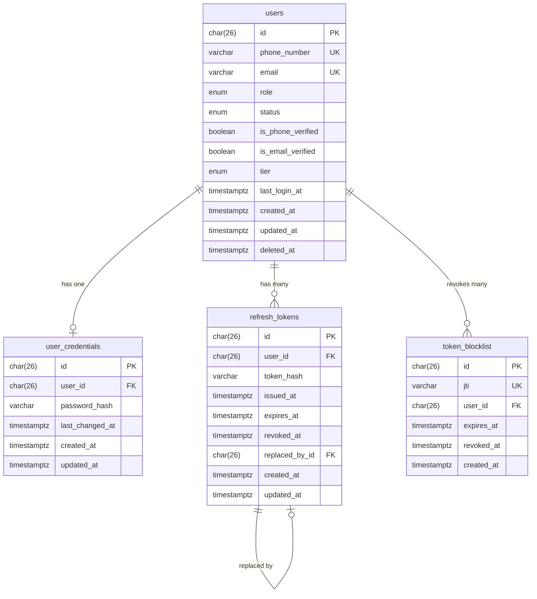
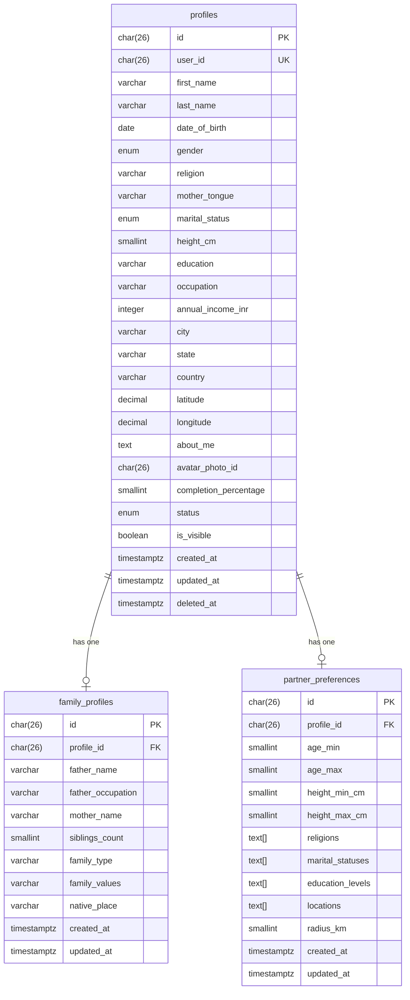
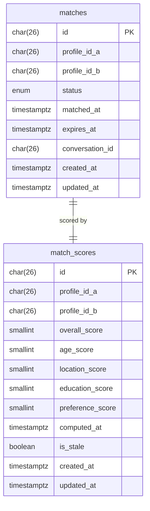
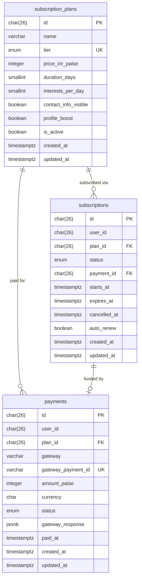

# Database Design — Matrimony Platform

**Version**: 1.0
**Status**: Approved
**Architecture Pattern**: Database-per-Service (no cross-service DB access)
**Primary Datastore**: PostgreSQL 15+
**Document Store**: MongoDB 7+
**Search Index**: Elasticsearch 8+
**Cache Layer**: Redis 7+

---

## Table of Contents

1. [Persistence Principles](#1-persistence-principles)
2. [Service Database Ownership](#2-service-database-ownership)
3. [Auth Service — Database Design](#3-auth-service--database-design)
4. [Profile Service — Database Design](#4-profile-service--database-design)
5. [Media Service — Database Design](#5-media-service--database-design)
6. [Search Service — Index Design](#6-search-service--index-design)
7. [Interest Service — Database Design](#7-interest-service--database-design)
8. [Matchmaking Service — Database Design](#8-matchmaking-service--database-design)
9. [Chat Service — Database Design](#9-chat-service--database-design)
10. [Notification Service — Database Design](#10-notification-service--database-design)
11. [Verification Service — Database Design](#11-verification-service--database-design)
12. [Subscription Service — Database Design](#12-subscription-service--database-design)
13. [Indexing Strategy](#13-indexing-strategy)
14. [Data Retention & Archival](#14-data-retention--archival)
15. [Redis Key Design](#15-redis-key-design)
16. [Migration Guidelines](#16-migration-guidelines)

---

## 1. Persistence Principles

### 1.1 Database-Per-Service Isolation

Each microservice owns its database exclusively. No service may query another service's database directly. Cross-service data access must go through the owning service's API or via consumed events.

```
✅ Auth Service reads its own `users` table.
✅ Profile Service reads its own `profiles` table.
❌ Search Service NEVER queries `profiles` table directly.
```

### 1.2 ID Strategy — ULID

All primary keys use **ULID** (Universally Unique Lexicographically Sortable Identifier):
- 26 characters, URL-safe, case-insensitive
- Monotonically sortable by creation time (no random UUID chaos in index)
- Stored as `CHAR(26)` in PostgreSQL, `String` in MongoDB

```
Example: 01HZ8J2KX3MNDP7Q4R5SVWXYZ
```

### 1.3 Universal Audit Columns

Every table in every service includes:

| Column | Type | Nullable | Default | Purpose |
| :--- | :--- | :---: | :--- | :--- |
| `created_at` | `TIMESTAMPTZ` | No | `NOW()` | Record creation timestamp |
| `updated_at` | `TIMESTAMPTZ` | No | `NOW()` | Last modification timestamp (auto-updated by trigger) |

### 1.4 Soft Delete Policy

Tables where data must be recoverable (user-initiated deletes, moderation holds) include:

| Column | Type | Nullable | Purpose |
| :--- | :--- | :---: | :--- |
| `deleted_at` | `TIMESTAMPTZ` | Yes | Non-null = soft-deleted; NULL = active |

All queries on soft-deletable tables must include `WHERE deleted_at IS NULL` unless explicitly performing audit/recovery queries.

### 1.5 Timestamp Standard

- All timestamps stored in **UTC** (`TIMESTAMPTZ` in PostgreSQL).
- Application layer converts to local timezone for display only.

### 1.6 Enum Strategy

Domain enumerations are stored as PostgreSQL native `ENUM` types to enforce data integrity at the database level. Adding new values requires a non-blocking `ALTER TYPE ... ADD VALUE` migration.

### 1.7 Naming Conventions

| Object | Convention | Example |
| :--- | :--- | :--- |
| Tables | `snake_case`, plural | `partner_preferences` |
| Columns | `snake_case` | `annual_income_inr` |
| Primary Keys | `id` (ULID) | `id CHAR(26)` |
| Foreign Keys | `{referenced_table_singular}_id` | `profile_id` |
| Indexes | `idx_{table}_{columns}` | `idx_profiles_city_state` |
| Unique Constraints | `uq_{table}_{columns}` | `uq_users_email` |
| Check Constraints | `ck_{table}_{rule}` | `ck_profiles_age_min_18` |

---

## 2. Service Database Ownership

| Service | Database Engine | Database Name | Secondary Store |
| :--- | :---: | :--- | :--- |
| Auth Service | PostgreSQL | `matrimony_auth` | Redis (`auth:*`) |
| Profile Service | PostgreSQL | `matrimony_profile` | — |
| Media Service | PostgreSQL | `matrimony_media` | AWS S3 (blob storage) |
| Search Service | Elasticsearch | `matrimony_search` index | — (synced via events) |
| Interest Service | PostgreSQL | `matrimony_interest` | — |
| Matchmaking Service | PostgreSQL | `matrimony_matchmaking` | Redis (`recommendations:*`) |
| Chat Service | MongoDB | `matrimony_chat` | — |
| Notification Service | PostgreSQL | `matrimony_notification` | Redis (`unread:*`) |
| Verification Service | PostgreSQL | `matrimony_verification` | Redis (`otp:*`, `lockout:*`) |
| Subscription Service | PostgreSQL | `matrimony_subscription` | — |

---

## 3. Auth Service — Database Design

**Database**: `matrimony_auth` (PostgreSQL)
**Tables**: `users`, `user_credentials`, `refresh_tokens`, `token_blocklist`

---

### Table: `users`

**Purpose**: Core identity record for every registered account. The authoritative source for user identity across the platform.

| Column | Type | Nullable | Default | Description |
| :--- | :--- | :---: | :--- | :--- |
| `id` | `CHAR(26)` | No | — | ULID primary key |
| `phone_number` | `VARCHAR(20)` | No | — | E.164 format (+919876543210) |
| `email` | `VARCHAR(255)` | No | — | Registered email address |
| `role` | `user_role` ENUM | No | `'SEEKER'` | Enum: `SEEKER`, `ADMIN` |
| `status` | `user_status` ENUM | No | `'PENDING'` | Enum: `PENDING`, `ACTIVE`, `SUSPENDED`, `DELETED` |
| `is_phone_verified` | `BOOLEAN` | No | `FALSE` | Phone OTP verified |
| `is_email_verified` | `BOOLEAN` | No | `FALSE` | Email link verified |
| `tier` | `user_tier` ENUM | No | `'FREE'` | Enum: `FREE`, `PREMIUM_BASIC`, `PREMIUM_PLUS` |
| `last_login_at` | `TIMESTAMPTZ` | Yes | `NULL` | Timestamp of most recent login |
| `created_at` | `TIMESTAMPTZ` | No | `NOW()` | Account creation timestamp |
| `updated_at` | `TIMESTAMPTZ` | No | `NOW()` | Last modification timestamp |
| `deleted_at` | `TIMESTAMPTZ` | Yes | `NULL` | Soft delete timestamp |

**Primary Key**: `id`

**Unique Constraints**:
- `uq_users_phone_number`: `phone_number` (globally unique)
- `uq_users_email`: `email` (globally unique)

**Check Constraints**:
- `ck_users_phone_format`: `phone_number ~ '^\+[1-9]\d{7,14}$'` (E.164 regex)

**Indexes**:
- `idx_users_email`: `(email)` — login lookup
- `idx_users_phone_number`: `(phone_number)` — OTP lookup
- `idx_users_status`: `(status)` — admin queries

---

### Table: `user_credentials`

**Purpose**: Stores hashed password for accounts using password-based registration. Separated from `users` to isolate credential data from identity data.

| Column | Type | Nullable | Default | Description |
| :--- | :--- | :---: | :--- | :--- |
| `id` | `CHAR(26)` | No | — | ULID primary key |
| `user_id` | `CHAR(26)` | No | — | FK → `users.id` |
| `password_hash` | `VARCHAR(255)` | No | — | bcrypt hash (cost=12) |
| `last_changed_at` | `TIMESTAMPTZ` | No | `NOW()` | Last password change |
| `created_at` | `TIMESTAMPTZ` | No | `NOW()` | — |
| `updated_at` | `TIMESTAMPTZ` | No | `NOW()` | — |

**Primary Key**: `id`

**Foreign Keys**:
- `user_id` → `users(id)` ON DELETE CASCADE

**Unique Constraints**:
- `uq_user_credentials_user_id`: `user_id` (one credential record per user)

---

### Table: `refresh_tokens`

**Purpose**: Persists issued refresh tokens to support token rotation and invalidation.

| Column | Type | Nullable | Default | Description |
| :--- | :--- | :---: | :--- | :--- |
| `id` | `CHAR(26)` | No | — | ULID primary key |
| `user_id` | `CHAR(26)` | No | — | FK → `users.id` |
| `token_hash` | `VARCHAR(255)` | No | — | SHA-256 hash of raw refresh token |
| `issued_at` | `TIMESTAMPTZ` | No | `NOW()` | Token creation time |
| `expires_at` | `TIMESTAMPTZ` | No | — | Token expiry (issued_at + 7 days) |
| `revoked_at` | `TIMESTAMPTZ` | Yes | `NULL` | Non-null = explicitly revoked |
| `replaced_by_id` | `CHAR(26)` | Yes | `NULL` | FK → `refresh_tokens.id` (rotation chain) |
| `created_at` | `TIMESTAMPTZ` | No | `NOW()` | — |
| `updated_at` | `TIMESTAMPTZ` | No | `NOW()` | — |

**Primary Key**: `id`

**Foreign Keys**:
- `user_id` → `users(id)` ON DELETE CASCADE
- `replaced_by_id` → `refresh_tokens(id)` ON DELETE SET NULL

**Indexes**:
- `idx_refresh_tokens_user_id`: `(user_id)` — list user's active tokens
- `idx_refresh_tokens_token_hash`: `(token_hash)` — token lookup on refresh

---

### Table: `token_blocklist`

**Purpose**: Redis-first blocklist for revoked JWT access tokens. PostgreSQL table as persistent fallback for Redis misses after Redis restart.

| Column | Type | Nullable | Default | Description |
| :--- | :--- | :---: | :--- | :--- |
| `id` | `CHAR(26)` | No | — | ULID primary key |
| `jti` | `VARCHAR(36)` | No | — | JWT ID claim (UUID v4) |
| `user_id` | `CHAR(26)` | No | — | FK → `users.id` |
| `expires_at` | `TIMESTAMPTZ` | No | — | Token expiry (purge after this) |
| `revoked_at` | `TIMESTAMPTZ` | No | `NOW()` | Revocation timestamp |
| `created_at` | `TIMESTAMPTZ` | No | `NOW()` | — |

**Primary Key**: `id`

**Unique Constraints**:
- `uq_token_blocklist_jti`: `jti`

**Indexes**:
- `idx_token_blocklist_jti`: `(jti)` — fast token validation lookup
- `idx_token_blocklist_expires_at`: `(expires_at)` — purge expired rows

### Entity Relationship Diagram — Auth Service



---

## 4. Profile Service — Database Design

**Database**: `matrimony_profile` (PostgreSQL)
**Tables**: `profiles`, `family_profiles`, `partner_preferences`

---

### Table: `profiles`

**Purpose**: Core matrimonial profile of a seeker. Aggregate root for all personal, educational, and lifestyle information.

| Column | Type | Nullable | Default | Description |
| :--- | :--- | :---: | :--- | :--- |
| `id` | `CHAR(26)` | No | — | ULID primary key |
| `user_id` | `CHAR(26)` | No | — | Auth service user ID (logical FK — no DB FK) |
| `first_name` | `VARCHAR(50)` | No | — | Seeker first name |
| `last_name` | `VARCHAR(50)` | No | — | Seeker last name |
| `date_of_birth` | `DATE` | No | — | Date of birth (age enforced ≥18) |
| `gender` | `gender_type` ENUM | No | — | Enum: `MALE`, `FEMALE` |
| `religion` | `VARCHAR(50)` | No | — | Religion |
| `caste` | `VARCHAR(50)` | Yes | `NULL` | Optional caste |
| `mother_tongue` | `VARCHAR(50)` | No | — | Primary language |
| `marital_status` | `marital_status_type` ENUM | No | — | Enum: `NEVER_MARRIED`, `DIVORCED`, `WIDOWED` |
| `height_cm` | `SMALLINT` | No | — | Height in centimeters |
| `body_type` | `VARCHAR(30)` | Yes | `NULL` | Optional body type |
| `diet` | `VARCHAR(30)` | Yes | `NULL` | Dietary preference |
| `smoking` | `VARCHAR(20)` | Yes | `NULL` | Smoking habit |
| `drinking` | `VARCHAR(20)` | Yes | `NULL` | Drinking habit |
| `education` | `VARCHAR(100)` | No | — | Highest education level |
| `education_detail` | `VARCHAR(200)` | Yes | `NULL` | Degree/institution detail |
| `occupation` | `VARCHAR(100)` | No | — | Current occupation |
| `employer` | `VARCHAR(150)` | Yes | `NULL` | Employer name |
| `annual_income_inr` | `INTEGER` | Yes | `NULL` | Annual income in INR |
| `city` | `VARCHAR(100)` | No | — | Current city |
| `state` | `VARCHAR(100)` | No | — | Current state |
| `country` | `VARCHAR(100)` | No | `'India'` | Country |
| `latitude` | `DECIMAL(9,6)` | Yes | `NULL` | Geo-coordinates for proximity search |
| `longitude` | `DECIMAL(9,6)` | Yes | `NULL` | Geo-coordinates for proximity search |
| `about_me` | `TEXT` | Yes | `NULL` | Free-text self-description (max 1000 chars) |
| `avatar_photo_id` | `CHAR(26)` | Yes | `NULL` | Logical FK → media service photo |
| `completion_percentage` | `SMALLINT` | No | `0` | Calculated completion score 0–100 |
| `status` | `profile_status` ENUM | No | `'DRAFT'` | Enum: `DRAFT`, `ACTIVE`, `PAUSED`, `SUSPENDED`, `DELETED` |
| `is_visible` | `BOOLEAN` | No | `TRUE` | Visible in search results |
| `is_premium` | `BOOLEAN` | No | `FALSE` | Denormalized tier flag for search index sync |
| `created_at` | `TIMESTAMPTZ` | No | `NOW()` | — |
| `updated_at` | `TIMESTAMPTZ` | No | `NOW()` | — |
| `deleted_at` | `TIMESTAMPTZ` | Yes | `NULL` | Soft delete |

**Primary Key**: `id`

**Unique Constraints**:
- `uq_profiles_user_id`: `user_id` (one profile per user account)

**Check Constraints**:
- `ck_profiles_age_min_18`: `date_of_birth <= CURRENT_DATE - INTERVAL '18 years'`
- `ck_profiles_height_range`: `height_cm BETWEEN 100 AND 250`
- `ck_profiles_completion_range`: `completion_percentage BETWEEN 0 AND 100`

**Indexes**:
- `idx_profiles_user_id`: `(user_id)` — profile lookup by auth user
- `idx_profiles_status_visible`: `(status, is_visible)` — active profile filter
- `idx_profiles_city_state`: `(city, state)` — location-based queries
- `idx_profiles_gender_religion`: `(gender, religion)` — search filter combination
- `idx_profiles_dob`: `(date_of_birth)` — age range filter
- `idx_profiles_geo`: `(latitude, longitude)` — proximity filtering

---

### Table: `family_profiles`

**Purpose**: Family background information for a seeker's profile. Optional but encouraged for completeness.

| Column | Type | Nullable | Default | Description |
| :--- | :--- | :---: | :--- | :--- |
| `id` | `CHAR(26)` | No | — | ULID primary key |
| `profile_id` | `CHAR(26)` | No | — | FK → `profiles.id` |
| `father_name` | `VARCHAR(100)` | Yes | `NULL` | Father's name |
| `father_occupation` | `VARCHAR(100)` | Yes | `NULL` | Father's occupation |
| `mother_name` | `VARCHAR(100)` | Yes | `NULL` | Mother's name |
| `mother_occupation` | `VARCHAR(100)` | Yes | `NULL` | Mother's occupation |
| `siblings_count` | `SMALLINT` | Yes | `NULL` | Number of siblings |
| `family_type` | `VARCHAR(30)` | Yes | `NULL` | Nuclear / Joint |
| `family_status` | `VARCHAR(30)` | Yes | `NULL` | Middle class, Upper middle, etc. |
| `family_values` | `VARCHAR(30)` | Yes | `NULL` | Traditional, Moderate, Liberal |
| `native_place` | `VARCHAR(100)` | Yes | `NULL` | Family native location |
| `created_at` | `TIMESTAMPTZ` | No | `NOW()` | — |
| `updated_at` | `TIMESTAMPTZ` | No | `NOW()` | — |

**Primary Key**: `id`

**Foreign Keys**:
- `profile_id` → `profiles(id)` ON DELETE CASCADE

**Unique Constraints**:
- `uq_family_profiles_profile_id`: `profile_id` (one family profile per profile)

---

### Table: `partner_preferences`

**Purpose**: Stores the seeker's acceptable partner criteria used for matching and search filtering.

| Column | Type | Nullable | Default | Description |
| :--- | :--- | :---: | :--- | :--- |
| `id` | `CHAR(26)` | No | — | ULID primary key |
| `profile_id` | `CHAR(26)` | No | — | FK → `profiles.id` |
| `age_min` | `SMALLINT` | No | `18` | Minimum acceptable age |
| `age_max` | `SMALLINT` | No | `60` | Maximum acceptable age |
| `height_min_cm` | `SMALLINT` | Yes | `NULL` | Minimum height (cm) |
| `height_max_cm` | `SMALLINT` | Yes | `NULL` | Maximum height (cm) |
| `religions` | `TEXT[]` | Yes | `NULL` | Array of acceptable religions |
| `castes` | `TEXT[]` | Yes | `NULL` | Array of acceptable castes (optional) |
| `marital_statuses` | `TEXT[]` | Yes | `NULL` | Array of acceptable marital statuses |
| `education_levels` | `TEXT[]` | Yes | `NULL` | Array of acceptable education levels |
| `locations` | `TEXT[]` | Yes | `NULL` | Array of preferred cities/states |
| `radius_km` | `SMALLINT` | Yes | `NULL` | Proximity radius from own city |
| `created_at` | `TIMESTAMPTZ` | No | `NOW()` | — |
| `updated_at` | `TIMESTAMPTZ` | No | `NOW()` | — |

**Primary Key**: `id`

**Foreign Keys**:
- `profile_id` → `profiles(id)` ON DELETE CASCADE

**Unique Constraints**:
- `uq_partner_preferences_profile_id`: `profile_id`

**Check Constraints**:
- `ck_partner_pref_age_order`: `age_min <= age_max`
- `ck_partner_pref_age_min`: `age_min >= 18`
- `ck_partner_pref_height_order`: `height_min_cm <= height_max_cm`

### Entity Relationship Diagram — Profile Service



---

## 5. Media Service — Database Design

**Database**: `matrimony_media` (PostgreSQL)
**Tables**: `photos`
**Blob Storage**: AWS S3

---

### Table: `photos`

**Purpose**: Stores metadata for all uploaded profile photos. Actual binary files reside in AWS S3.

| Column | Type | Nullable | Default | Description |
| :--- | :--- | :---: | :--- | :--- |
| `id` | `CHAR(26)` | No | — | ULID primary key |
| `profile_id` | `CHAR(26)` | No | — | Logical FK → Profile service (no DB FK) |
| `s3_bucket` | `VARCHAR(100)` | No | — | S3 bucket name |
| `s3_key` | `VARCHAR(500)` | No | — | Full S3 object key path |
| `cdn_url` | `VARCHAR(500)` | No | — | Public CDN URL |
| `thumbnail_key` | `VARCHAR(500)` | Yes | `NULL` | S3 key for generated thumbnail |
| `thumbnail_url` | `VARCHAR(500)` | Yes | `NULL` | CDN URL for thumbnail |
| `file_size_bytes` | `INTEGER` | No | — | File size in bytes |
| `mime_type` | `VARCHAR(50)` | No | — | e.g. `image/jpeg` |
| `width_px` | `SMALLINT` | Yes | `NULL` | Image width in pixels |
| `height_px` | `SMALLINT` | Yes | `NULL` | Image height in pixels |
| `visibility` | `photo_visibility` ENUM | No | `'PUBLIC'` | Enum: `PUBLIC`, `MATCHES_ONLY`, `PRIVATE` |
| `is_primary` | `BOOLEAN` | No | `FALSE` | Profile avatar flag |
| `sort_order` | `SMALLINT` | No | `0` | Display order position |
| `created_at` | `TIMESTAMPTZ` | No | `NOW()` | — |
| `updated_at` | `TIMESTAMPTZ` | No | `NOW()` | — |
| `deleted_at` | `TIMESTAMPTZ` | Yes | `NULL` | Soft delete (S3 cleanup scheduled) |

**Primary Key**: `id`

**Unique Constraints**:
- `uq_photos_s3_key`: `s3_key` (each S3 path is globally unique)

**Check Constraints**:
- `ck_photos_file_size`: `file_size_bytes BETWEEN 1 AND 5242880` (max 5 MB)
- `ck_photos_mime_type`: `mime_type IN ('image/jpeg', 'image/png', 'image/webp')`

**Indexes**:
- `idx_photos_profile_id`: `(profile_id)` — list profile photos
- `idx_photos_profile_id_primary`: `(profile_id, is_primary)` — avatar lookup
- `idx_photos_profile_id_visibility`: `(profile_id, visibility)` — visibility-filtered photo loads
- `idx_photos_deleted_at`: `(deleted_at) WHERE deleted_at IS NOT NULL` — S3 cleanup job filter

---

## 6. Search Service — Index Design

**Engine**: Elasticsearch 8+
**Index Name**: `matrimony_search_profiles`

The Search Service maintains a **denormalized read-only index** of active profiles. It does not own a PostgreSQL database. Index documents are created/updated by consuming profile lifecycle events from RabbitMQ.

### Index Mapping

```json
{
  "mappings": {
    "properties": {
      "profile_id":            { "type": "keyword" },
      "user_id":               { "type": "keyword" },
      "display_name":          { "type": "text", "analyzer": "standard" },
      "gender":                { "type": "keyword" },
      "date_of_birth":         { "type": "date", "format": "yyyy-MM-dd" },
      "age":                   { "type": "integer" },
      "religion":              { "type": "keyword" },
      "caste":                 { "type": "keyword" },
      "mother_tongue":         { "type": "keyword" },
      "marital_status":        { "type": "keyword" },
      "height_cm":             { "type": "integer" },
      "education":             { "type": "keyword" },
      "occupation":            { "type": "keyword" },
      "annual_income_inr":     { "type": "long" },
      "city":                  { "type": "keyword" },
      "state":                 { "type": "keyword" },
      "country":               { "type": "keyword" },
      "location":              { "type": "geo_point" },
      "avatar_url":            { "type": "keyword", "index": false },
      "is_verified":           { "type": "boolean" },
      "is_premium":            { "type": "boolean" },
      "is_visible":            { "type": "boolean" },
      "status":                { "type": "keyword" },
      "completion_percentage": { "type": "integer" },
      "indexed_at":            { "type": "date" },
      "profile_created_at":    { "type": "date" }
    }
  },
  "settings": {
    "number_of_shards": 3,
    "number_of_replicas": 1,
    "refresh_interval": "5s"
  }
}
```

### Index Lifecycle Rules
- Only profiles with `status = ACTIVE` and `is_visible = TRUE` are indexed.
- Suspended or deleted profiles are immediately removed from the index on event consumption.
- `age` field is a computed integer derived from `date_of_birth` and recomputed nightly.

---

## 7. Interest Service — Database Design

**Database**: `matrimony_interest` (PostgreSQL)
**Tables**: `interests`

---

### Table: `interests`

**Purpose**: Represents a double-opt-in connection request from one seeker to another.

| Column | Type | Nullable | Default | Description |
| :--- | :--- | :---: | :--- | :--- |
| `id` | `CHAR(26)` | No | — | ULID primary key |
| `sender_profile_id` | `CHAR(26)` | No | — | Logical FK → Profile service |
| `receiver_profile_id` | `CHAR(26)` | No | — | Logical FK → Profile service |
| `status` | `interest_status` ENUM | No | `'PENDING'` | Enum: `PENDING`, `ACCEPTED`, `REJECTED`, `EXPIRED` |
| `message` | `VARCHAR(500)` | Yes | `NULL` | Optional introductory message |
| `sent_at` | `TIMESTAMPTZ` | No | `NOW()` | When the interest was sent |
| `responded_at` | `TIMESTAMPTZ` | Yes | `NULL` | When receiver accepted/rejected |
| `expires_at` | `TIMESTAMPTZ` | No | — | Auto-expire after 30 days if no response |
| `created_at` | `TIMESTAMPTZ` | No | `NOW()` | — |
| `updated_at` | `TIMESTAMPTZ` | No | `NOW()` | — |

**Primary Key**: `id`

**Unique Constraints**:
- `uq_interests_sender_receiver`: `(sender_profile_id, receiver_profile_id)` — prevents duplicate interest requests

**Check Constraints**:
- `ck_interests_no_self_interest`: `sender_profile_id != receiver_profile_id`

**Indexes**:
- `idx_interests_sender`: `(sender_profile_id, status)` — sent interests inbox
- `idx_interests_receiver`: `(receiver_profile_id, status)` — received interests inbox
- `idx_interests_expires_at`: `(expires_at) WHERE status = 'PENDING'` — auto-expiry cron job

---

## 8. Matchmaking Service — Database Design

**Database**: `matrimony_matchmaking` (PostgreSQL)
**Tables**: `matches`, `match_scores`

---

### Table: `matches`

**Purpose**: Represents a confirmed mutual connection between two seekers after double-opt-in. Triggers chat and unlocks contact visibility.

| Column | Type | Nullable | Default | Description |
| :--- | :--- | :---: | :--- | :--- |
| `id` | `CHAR(26)` | No | — | ULID primary key |
| `profile_id_a` | `CHAR(26)` | No | — | Logical FK → Profile service (always lower ULID for uniqueness) |
| `profile_id_b` | `CHAR(26)` | No | — | Logical FK → Profile service (always higher ULID) |
| `status` | `match_status` ENUM | No | `'ACTIVE'` | Enum: `ACTIVE`, `EXPIRED`, `WITHDRAWN` |
| `matched_at` | `TIMESTAMPTZ` | No | `NOW()` | When match was created |
| `expires_at` | `TIMESTAMPTZ` | Yes | `NULL` | Optional expiry for inactive matches |
| `conversation_id` | `CHAR(26)` | Yes | `NULL` | Logical FK → Chat service conversation |
| `created_at` | `TIMESTAMPTZ` | No | `NOW()` | — |
| `updated_at` | `TIMESTAMPTZ` | No | `NOW()` | — |

**Primary Key**: `id`

**Unique Constraints**:
- `uq_matches_profile_pair`: `(profile_id_a, profile_id_b)` — one match per profile pair

**Check Constraints**:
- `ck_matches_profile_order`: `profile_id_a < profile_id_b` — enforce canonical ordering to ensure uniqueness

**Indexes**:
- `idx_matches_profile_a`: `(profile_id_a, status)` — match feed for profile A
- `idx_matches_profile_b`: `(profile_id_b, status)` — match feed for profile B
- `idx_matches_status`: `(status)` — expiry cron job

---

### Table: `match_scores`

**Purpose**: Stores the computed multi-factor compatibility score for each profile pair. Used for recommendation ranking and match detail display.

| Column | Type | Nullable | Default | Description |
| :--- | :--- | :---: | :--- | :--- |
| `id` | `CHAR(26)` | No | — | ULID primary key |
| `profile_id_a` | `CHAR(26)` | No | — | Logical FK → Profile service |
| `profile_id_b` | `CHAR(26)` | No | — | Logical FK → Profile service |
| `overall_score` | `SMALLINT` | No | — | Composite compatibility score 0–100 |
| `age_score` | `SMALLINT` | No | — | Age compatibility component |
| `location_score` | `SMALLINT` | No | — | Location proximity component |
| `education_score` | `SMALLINT` | No | — | Education compatibility component |
| `preference_score` | `SMALLINT` | No | — | Preference overlap component |
| `computed_at` | `TIMESTAMPTZ` | No | `NOW()` | Score computation timestamp |
| `is_stale` | `BOOLEAN` | No | `FALSE` | Marks score for recomputation on profile update |
| `created_at` | `TIMESTAMPTZ` | No | `NOW()` | — |
| `updated_at` | `TIMESTAMPTZ` | No | `NOW()` | — |

**Primary Key**: `id`

**Unique Constraints**:
- `uq_match_scores_pair`: `(profile_id_a, profile_id_b)`

**Check Constraints**:
- `ck_match_scores_range`: `overall_score BETWEEN 0 AND 100`
- `ck_match_scores_order`: `profile_id_a < profile_id_b`

**Indexes**:
- `idx_match_scores_profile_a`: `(profile_id_a, overall_score DESC)` — top recommendations for a profile
- `idx_match_scores_stale`: `(is_stale) WHERE is_stale = TRUE` — recomputation queue

### Entity Relationship Diagram — Matchmaking Service



---

## 9. Chat Service — Database Design

**Database**: `matrimony_chat` (MongoDB 7+)
**Collections**: `conversations`, `messages`

MongoDB is chosen for Chat because:
- Message documents are append-heavy, rarely updated
- Flexible schema accommodates future message types (images, reactions)
- Native time-series–friendly access patterns
- Horizontal sharding by `conversation_id`

---

### Collection: `conversations`

**Purpose**: Chat room metadata connecting two matched participants.

```json
{
  "_id": "cnv_01HZ8...",
  "match_id": "mat_01HZ8...",
  "participants": [
    { "profile_id": "prf_01HZ8...", "joined_at": "2024-06-21T12:00:00Z" },
    { "profile_id": "prf_01HZ9...", "joined_at": "2024-06-21T12:00:00Z" }
  ],
  "status": "OPEN",
  "last_message": {
    "content": "Hi there!",
    "sender_profile_id": "prf_01HZ8...",
    "sent_at": "2024-06-21T15:00:00Z"
  },
  "unread_counts": {
    "prf_01HZ8...": 0,
    "prf_01HZ9...": 2
  },
  "created_at": { "$date": "2024-06-21T12:00:00Z" },
  "updated_at": { "$date": "2024-06-21T15:00:00Z" }
}
```

**Status Values**: `OPEN`, `CLOSED`

**Indexes**:
```javascript
// Participant lookup
db.conversations.createIndex({ "participants.profile_id": 1, "status": 1 })

// Match lookup
db.conversations.createIndex({ "match_id": 1 }, { unique: true })

// Conversation list sorted by recency
db.conversations.createIndex({ "participants.profile_id": 1, "updated_at": -1 })
```

---

### Collection: `messages`

**Purpose**: Individual text messages within a conversation. Sharded by `conversation_id`.

```json
{
  "_id": "msg_01HZ8...",
  "conversation_id": "cnv_01HZ8...",
  "sender_profile_id": "prf_01HZ8...",
  "content": "Hello! Great to connect.",
  "content_type": "TEXT",
  "status": "READ",
  "is_contact_filtered": false,
  "sent_at": { "$date": "2024-06-21T15:00:00Z" },
  "delivered_at": { "$date": "2024-06-21T15:00:01Z" },
  "read_at": { "$date": "2024-06-21T15:01:00Z" },
  "created_at": { "$date": "2024-06-21T15:00:00Z" }
}
```

**Status Values**: `SENT`, `DELIVERED`, `READ`
**Content Types**: `TEXT` (MVP)

**Indexes**:
```javascript
// Timeline cursor pagination (primary query pattern)
db.messages.createIndex({ "conversation_id": 1, "sent_at": -1 })

// Participant read-status queries
db.messages.createIndex({ "conversation_id": 1, "sender_profile_id": 1, "status": 1 })
```

**Shard Key**: `conversation_id` (ensures all messages for a conversation are co-located)

---

## 10. Notification Service — Database Design

**Database**: `matrimony_notification` (PostgreSQL)
**Tables**: `notifications`

---

### Table: `notifications`

**Purpose**: Stores all platform-generated alerts for a user — interests received, messages, match events, system notices.

| Column | Type | Nullable | Default | Description |
| :--- | :--- | :---: | :--- | :--- |
| `id` | `CHAR(26)` | No | — | ULID primary key |
| `user_id` | `CHAR(26)` | No | — | Logical FK → Auth service user |
| `type` | `notification_type` ENUM | No | — | Enum: `INTEREST_RECEIVED`, `INTEREST_ACCEPTED`, `MESSAGE_RECEIVED`, `MATCH_CREATED`, `SUBSCRIPTION_EXPIRING`, `SYSTEM_ALERT` |
| `channel` | `notification_channel` ENUM | No | — | Enum: `IN_APP`, `PUSH`, `EMAIL`, `SMS` |
| `title` | `VARCHAR(150)` | No | — | Short notification title |
| `body` | `VARCHAR(500)` | No | — | Full notification body |
| `action_url` | `VARCHAR(255)` | Yes | `NULL` | Deep link URL for navigation |
| `reference_id` | `CHAR(26)` | Yes | `NULL` | Related entity ID (interest_id, match_id, etc.) |
| `reference_type` | `VARCHAR(50)` | Yes | `NULL` | Type of referenced entity |
| `is_read` | `BOOLEAN` | No | `FALSE` | Read status |
| `read_at` | `TIMESTAMPTZ` | Yes | `NULL` | Timestamp when marked read |
| `created_at` | `TIMESTAMPTZ` | No | `NOW()` | — |
| `updated_at` | `TIMESTAMPTZ` | No | `NOW()` | — |

**Primary Key**: `id`

**Indexes**:
- `idx_notifications_user_id_read`: `(user_id, is_read, created_at DESC)` — primary inbox query
- `idx_notifications_user_id_created`: `(user_id, created_at DESC)` — full notification history
- `idx_notifications_reference`: `(reference_id, reference_type)` — notification lookup by entity

---

## 11. Verification Service — Database Design

**Database**: `matrimony_verification` (PostgreSQL)
**Tables**: `verification_requests`

---

### Table: `verification_requests`

**Purpose**: Tracks OTP and email verification tickets with expiry and lockout state.

| Column | Type | Nullable | Default | Description |
| :--- | :--- | :---: | :--- | :--- |
| `id` | `CHAR(26)` | No | — | ULID primary key |
| `user_id` | `CHAR(26)` | No | — | Logical FK → Auth service user |
| `type` | `verification_type` ENUM | No | — | Enum: `PHONE_OTP`, `EMAIL_LINK` |
| `status` | `verification_status` ENUM | No | `'PENDING'` | Enum: `PENDING`, `APPROVED`, `REJECTED`, `EXPIRED` |
| `target` | `VARCHAR(255)` | No | — | Phone number or email address being verified |
| `code_hash` | `VARCHAR(255)` | Yes | `NULL` | Hashed OTP code (NULL for email link type) |
| `token` | `VARCHAR(100)` | Yes | `NULL` | Email magic link token (NULL for OTP type) |
| `attempt_count` | `SMALLINT` | No | `0` | Number of failed verification attempts |
| `issued_at` | `TIMESTAMPTZ` | No | `NOW()` | When the verification was issued |
| `expires_at` | `TIMESTAMPTZ` | No | — | Expiry (5 min for OTP, 15 min for email link) |
| `verified_at` | `TIMESTAMPTZ` | Yes | `NULL` | Timestamp of successful verification |
| `created_at` | `TIMESTAMPTZ` | No | `NOW()` | — |
| `updated_at` | `TIMESTAMPTZ` | No | `NOW()` | — |

**Primary Key**: `id`

**Check Constraints**:
- `ck_verification_attempt_limit`: `attempt_count <= 3`

**Indexes**:
- `idx_verification_user_type_status`: `(user_id, type, status)` — check existing pending ticket
- `idx_verification_expires_at`: `(expires_at) WHERE status = 'PENDING'` — cleanup cron job
- `idx_verification_token`: `(token) WHERE token IS NOT NULL` — email link lookup

---

## 12. Subscription Service — Database Design

**Database**: `matrimony_subscription` (PostgreSQL)
**Tables**: `subscription_plans`, `subscriptions`, `payments`

---

### Table: `subscription_plans`

**Purpose**: Catalogue of available membership plans. Seeded data, rarely changes.

| Column | Type | Nullable | Default | Description |
| :--- | :--- | :---: | :--- | :--- |
| `id` | `CHAR(26)` | No | — | ULID primary key |
| `name` | `VARCHAR(100)` | No | — | Plan display name |
| `tier` | `user_tier` ENUM | No | — | Enum: `FREE`, `PREMIUM_BASIC`, `PREMIUM_PLUS` |
| `price_inr_paise` | `INTEGER` | No | — | Price in paise (INR × 100). 0 for Free. |
| `duration_days` | `SMALLINT` | Yes | `NULL` | Plan duration. NULL = indefinite (Free). |
| `interests_per_day` | `SMALLINT` | No | — | Daily interest limit (-1 = unlimited) |
| `recommendations_per_day` | `SMALLINT` | No | — | Daily recommendation limit |
| `contact_info_visible` | `BOOLEAN` | No | `FALSE` | Can view contact details |
| `profile_boost` | `BOOLEAN` | No | `FALSE` | Profile promoted in search |
| `read_receipts` | `BOOLEAN` | No | `FALSE` | Can see message read receipts |
| `is_active` | `BOOLEAN` | No | `TRUE` | Plan available for purchase |
| `created_at` | `TIMESTAMPTZ` | No | `NOW()` | — |
| `updated_at` | `TIMESTAMPTZ` | No | `NOW()` | — |

**Primary Key**: `id`

**Unique Constraints**:
- `uq_subscription_plans_tier`: `tier`

---

### Table: `subscriptions`

**Purpose**: A user's active or historical subscription record. One active subscription per user at a time.

| Column | Type | Nullable | Default | Description |
| :--- | :--- | :---: | :--- | :--- |
| `id` | `CHAR(26)` | No | — | ULID primary key |
| `user_id` | `CHAR(26)` | No | — | Logical FK → Auth service user |
| `plan_id` | `CHAR(26)` | No | — | FK → `subscription_plans.id` |
| `status` | `subscription_status` ENUM | No | `'ACTIVE'` | Enum: `ACTIVE`, `EXPIRED`, `CANCELLED` |
| `payment_id` | `CHAR(26)` | Yes | `NULL` | FK → `payments.id` (NULL for Free tier) |
| `starts_at` | `TIMESTAMPTZ` | No | `NOW()` | Subscription start |
| `expires_at` | `TIMESTAMPTZ` | Yes | `NULL` | Subscription expiry (NULL for indefinite Free) |
| `cancelled_at` | `TIMESTAMPTZ` | Yes | `NULL` | Cancellation timestamp |
| `auto_renew` | `BOOLEAN` | No | `FALSE` | Auto-renewal flag (MVP: always false) |
| `created_at` | `TIMESTAMPTZ` | No | `NOW()` | — |
| `updated_at` | `TIMESTAMPTZ` | No | `NOW()` | — |

**Primary Key**: `id`

**Foreign Keys**:
- `plan_id` → `subscription_plans(id)`
- `payment_id` → `payments(id)`

**Indexes**:
- `idx_subscriptions_user_id_status`: `(user_id, status)` — active subscription lookup
- `idx_subscriptions_expires_at`: `(expires_at) WHERE status = 'ACTIVE'` — expiry cron job

---

### Table: `payments`

**Purpose**: Immutable record of each payment transaction processed through the payment gateway.

| Column | Type | Nullable | Default | Description |
| :--- | :--- | :---: | :--- | :--- |
| `id` | `CHAR(26)` | No | — | ULID primary key |
| `user_id` | `CHAR(26)` | No | — | Logical FK → Auth service user |
| `plan_id` | `CHAR(26)` | No | — | FK → `subscription_plans.id` |
| `gateway` | `VARCHAR(50)` | No | — | Payment gateway name (e.g. `stripe`, `razorpay`) |
| `gateway_payment_id` | `VARCHAR(200)` | No | — | External payment ID from gateway |
| `gateway_order_id` | `VARCHAR(200)` | Yes | `NULL` | External order ID from gateway |
| `amount_paise` | `INTEGER` | No | — | Amount charged in paise |
| `currency` | `CHAR(3)` | No | `'INR'` | ISO 4217 currency code |
| `status` | `payment_status` ENUM | No | — | Enum: `PENDING`, `SUCCESS`, `FAILED`, `REFUNDED` |
| `gateway_response` | `JSONB` | Yes | `NULL` | Raw gateway response for audit trail |
| `paid_at` | `TIMESTAMPTZ` | Yes | `NULL` | Successful payment timestamp |
| `created_at` | `TIMESTAMPTZ` | No | `NOW()` | — |
| `updated_at` | `TIMESTAMPTZ` | No | `NOW()` | — |

**Primary Key**: `id`

**Unique Constraints**:
- `uq_payments_gateway_payment_id`: `gateway_payment_id` (prevents duplicate charge recording)

**Indexes**:
- `idx_payments_user_id`: `(user_id, created_at DESC)` — payment history
- `idx_payments_gateway_payment_id`: `(gateway_payment_id)` — webhook reconciliation

### Entity Relationship Diagram — Subscription Service



---

## 13. Indexing Strategy

### 13.1 Profile Search Indexes

| Index | Table / Index | Columns | Query Pattern |
| :--- | :--- | :--- | :--- |
| `idx_profiles_status_visible` | `profiles` | `(status, is_visible)` | Filter active visible profiles |
| `idx_profiles_gender_religion` | `profiles` | `(gender, religion)` | Search with gender + religion filter |
| `idx_profiles_dob` | `profiles` | `(date_of_birth)` | Age range filter |
| `idx_profiles_city_state` | `profiles` | `(city, state)` | Location filter |
| `idx_profiles_geo` | `profiles` | `(latitude, longitude)` | Proximity radius filter |
| ES: `location` field | Elasticsearch | `geo_point` | Elasticsearch geo-distance query |
| ES: multi-field filter | Elasticsearch | `gender`, `religion`, `age`, `city` | Compound search filter query |

### 13.2 Interest Inbox Indexes

| Index | Columns | Query Pattern |
| :--- | :--- | :--- |
| `idx_interests_sender` | `(sender_profile_id, status)` | Sent interests list, filtered by status |
| `idx_interests_receiver` | `(receiver_profile_id, status)` | Received interests list, filtered by status |
| `idx_interests_expires_at` | `(expires_at) WHERE status = 'PENDING'` | Auto-expiry cron — partial index |

### 13.3 Match Feed Indexes

| Index | Columns | Query Pattern |
| :--- | :--- | :--- |
| `idx_matches_profile_a` | `(profile_id_a, status)` | Match feed for profile A |
| `idx_matches_profile_b` | `(profile_id_b, status)` | Match feed for profile B |
| `idx_match_scores_profile_a` | `(profile_id_a, overall_score DESC)` | Top compatibility-ordered recommendations |
| `idx_match_scores_stale` | `(is_stale) WHERE is_stale = TRUE` | Recomputation queue partial index |

### 13.4 Chat Message Timeline Indexes

| Index | Collection | Fields | Query Pattern |
| :--- | :--- | :--- | :--- |
| Message timeline | `messages` | `{ conversation_id: 1, sent_at: -1 }` | Cursor-paginated chat history |
| Conversation list | `conversations` | `{ "participants.profile_id": 1, updated_at: -1 }` | Sorted inbox by recency |
| Match lookup | `conversations` | `{ match_id: 1 }` unique | Conversation lookup by match |

### 13.5 Notification Inbox Indexes

| Index | Columns | Query Pattern |
| :--- | :--- | :--- |
| `idx_notifications_user_id_read` | `(user_id, is_read, created_at DESC)` | Unread notification inbox |
| `idx_notifications_user_id_created` | `(user_id, created_at DESC)` | All notifications history |

### 13.6 Subscription Expiry Indexes

| Index | Columns | Query Pattern |
| :--- | :--- | :--- |
| `idx_subscriptions_expires_at` | `(expires_at) WHERE status = 'ACTIVE'` | Expiry cron — partial index |
| `idx_subscriptions_user_id_status` | `(user_id, status)` | Active subscription feature gating |

---

## 14. Data Retention & Archival

### 14.1 Retention Rules Summary

| Data Category | Retention Period | Action After Expiry |
| :--- | :---: | :--- |
| Active user accounts | Indefinite while active | — |
| Deleted user accounts | 90 days after `deleted_at` | Hard purge from `users` table |
| Profile data | Follows account deletion | Cascade delete |
| Chat messages | 2 years from `sent_at` | Archive to cold storage, then purge |
| Notifications | 90 days from `created_at` | Hard purge |
| Verification requests | 30 days from `created_at` | Hard purge |
| Payment records | 7 years | Regulatory compliance — never purge |
| Refresh tokens | 7 days from `issued_at` | Hard purge if revoked or expired |
| Token blocklist entries | TTL = token `expires_at` | Hard purge after expiry |
| OTP codes (Redis) | 5 minutes TTL | Auto-evicted by Redis |
| Match scores | 1 year from `computed_at` | Recompute if profile updated |

### 14.2 Archival Strategy

- **Chat Messages**: After 2 years, messages are moved to an S3 archive bucket in JSONL format, keyed by `conversation_id/year/month/`. PostgreSQL row is soft-deleted.
- **Payment Records**: Never deleted. Retained in primary PostgreSQL for 7 years, then migrated to a read-only audit database.
- **User Accounts**: On account deletion, all PII fields are overwritten with `REDACTED_{user_id}` (pseudonymization) before the 90-day hard purge window to comply with DPDP Act.

### 14.3 DPDP Act Compliance (India)

- Users may request data erasure. On request, PII fields in `users`, `profiles` are pseudonymized within 72 hours.
- A `data_deletion_requests` audit table (in `matrimony_auth`) logs all erasure requests with timestamps for compliance proof.
- Payment records are retained with pseudonymized user references (regulatory exception).

---

## 15. Redis Key Design

All Redis keys follow a namespaced pattern: `{service}:{type}:{identifier}`.

### 15.1 Auth Service Keys

| Key Pattern | Type | TTL | Purpose |
| :--- | :---: | :---: | :--- |
| `auth:session:{user_id}` | Hash | 15 min | Active JWT session metadata |
| `auth:blocklist:{jti}` | String | Until token `exp` | Revoked JWT JTI blocklist |
| `auth:refresh_rotation:{user_id}` | String | 7 days | Current valid refresh token hash |

### 15.2 Verification Service Keys

| Key Pattern | Type | TTL | Purpose |
| :--- | :---: | :---: | :--- |
| `verify:otp:{phone_number}` | Hash | 5 min | OTP code and metadata |
| `verify:lockout:{phone_number}` | String | 1 hour | Brute-force lockout flag |
| `verify:attempts:{phone_number}` | Integer | 15 min | Failed OTP attempt counter |

### 15.3 Rate Limiting Keys

| Key Pattern | Type | TTL | Purpose |
| :--- | :---: | :---: | :--- |
| `ratelimit:ip:{ip_address}:{endpoint}` | Integer | 15 min | Unauthenticated IP rate counter |
| `ratelimit:user:{user_id}:{endpoint}` | Integer | Varies | Per-user per-endpoint counter |
| `ratelimit:otp:{phone_number}` | Integer | 15 min | OTP request counter |
| `ratelimit:interest:{user_id}` | Integer | 24 hours | Daily interest send counter |

### 15.4 Matchmaking Cache Keys

| Key Pattern | Type | TTL | Purpose |
| :--- | :---: | :---: | :--- |
| `recommendations:{profile_id}` | List | 24 hours | Pre-computed daily recommendation list |

### 15.5 Notification Cache Keys

| Key Pattern | Type | TTL | Purpose |
| :--- | :---: | :---: | :--- |
| `unread:{user_id}` | Integer | 1 hour | Cached unread notification count |

### 15.6 Redis Configuration Recommendations

| Setting | Value | Reason |
| :--- | :--- | :--- |
| `maxmemory-policy` | `allkeys-lru` | Evict least-recently-used keys on memory pressure |
| `save` | Disabled | Redis is a cache layer; persistence via PostgreSQL |
| Keyspace notifications | `Ex` (expired events) | Alert on lockout key expiry |

---

## 16. Migration Guidelines

### 16.1 Tooling

Use **Flyway** (JVM) or **golang-migrate** (Go) or **Knex migrations** (Node.js) — one migration runner per service database. Each service maintains its own isolated migration history table (`flyway_schema_history` or `schema_migrations`).

### 16.2 File Naming Convention

```
V{yyyyMMdd}{HHmm}__{description}.sql

Examples:
  V202406211430__create_users_table.sql
  V202406211445__add_tier_column_to_users.sql
  V202406211500__create_user_credentials_table.sql
```

### 16.3 Zero-Downtime Migration Rules

| Change Type | Strategy |
| :--- | :--- |
| Add new column (nullable) | Safe to deploy without downtime |
| Add new column (NOT NULL) | First deploy with nullable default → backfill → add NOT NULL constraint |
| Add new index | Use `CREATE INDEX CONCURRENTLY` to avoid table lock |
| Drop column | Three-step: 1) Stop writing to column 2) Deploy without reads 3) Drop column |
| Rename column | Three-step: 1) Add new column 2) Dual-write 3) Drop old column |
| Rename table | Use a view to alias the old name during transition |
| Add ENUM value | `ALTER TYPE ... ADD VALUE` is non-blocking in PostgreSQL 12+ |
| Remove ENUM value | Requires a full type replacement (version bump required) |

### 16.4 Rollback Strategy

- Every migration file must have an accompanying `undo` script if the migration is reversible.
- Irreversible migrations (e.g., hard data deletes) must be marked with a `-- IRREVERSIBLE` header comment.
- Migration validation is run in CI via a dry-run against a disposable test database before deployment.

### 16.5 Migration Execution Order

```
1. Run migrations on idle database replica
2. Validate data integrity on replica
3. Promote replica or apply to primary with maintenance window if required
4. Monitor for errors in the 10 minutes following deployment
5. Rollback script ready on standby during this window
```

---

## Appendix A — Table Catalog Summary

| Service | Database | Tables / Collections | Engine |
| :--- | :--- | :--- | :--- |
| Auth | `matrimony_auth` | `users`, `user_credentials`, `refresh_tokens`, `token_blocklist` | PostgreSQL |
| Profile | `matrimony_profile` | `profiles`, `family_profiles`, `partner_preferences` | PostgreSQL |
| Media | `matrimony_media` | `photos` | PostgreSQL |
| Search | `matrimony_search` | `profiles` (index) | Elasticsearch |
| Interest | `matrimony_interest` | `interests` | PostgreSQL |
| Matchmaking | `matrimony_matchmaking` | `matches`, `match_scores` | PostgreSQL |
| Chat | `matrimony_chat` | `conversations`, `messages` | MongoDB |
| Notification | `matrimony_notification` | `notifications` | PostgreSQL |
| Verification | `matrimony_verification` | `verification_requests` | PostgreSQL |
| Subscription | `matrimony_subscription` | `subscription_plans`, `subscriptions`, `payments` | PostgreSQL |

**Total**: 18 tables / collections across 10 isolated service databases
