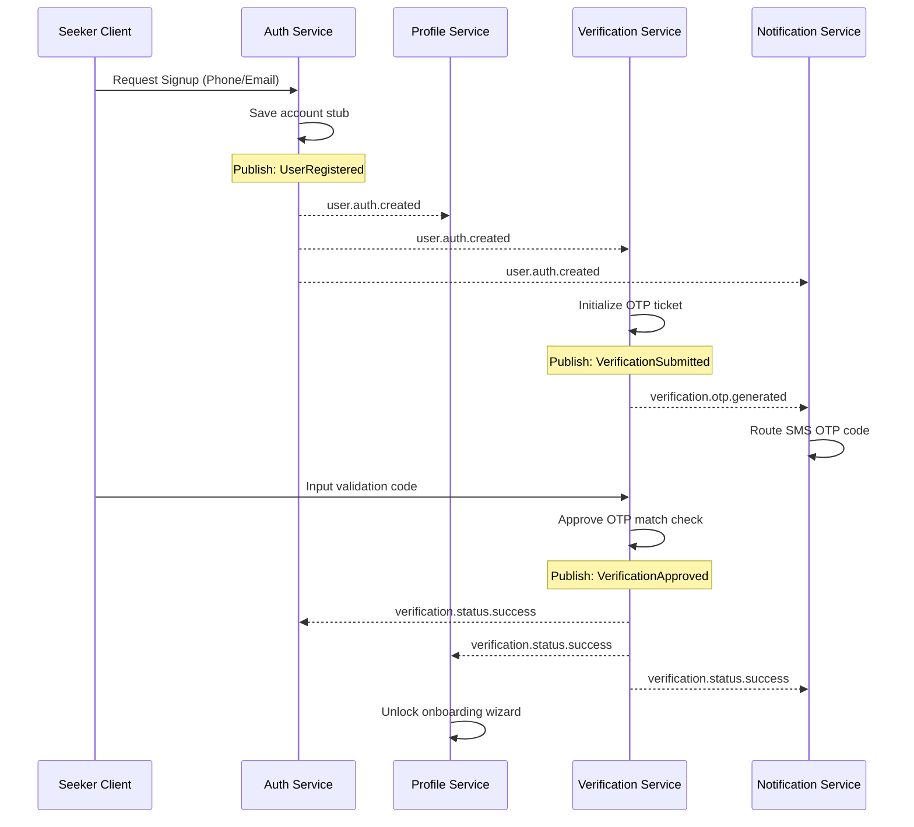
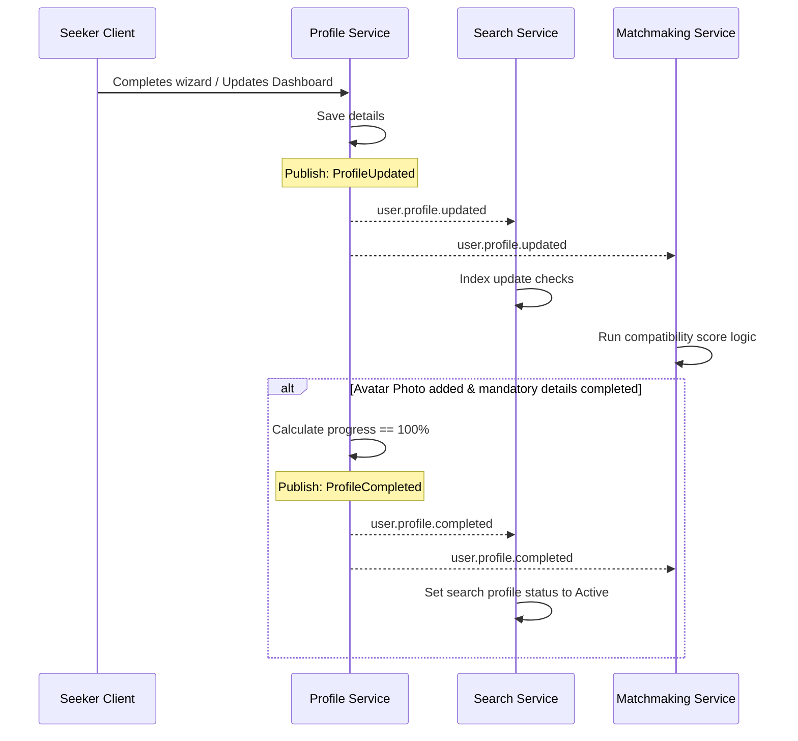
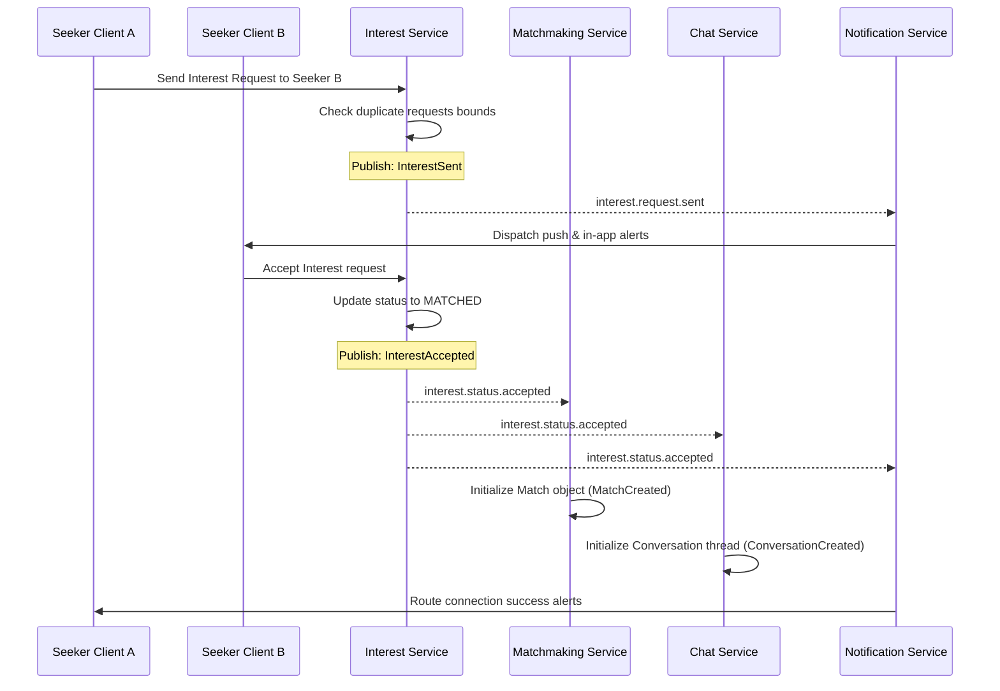
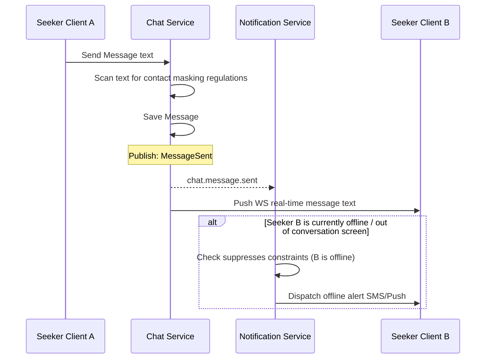
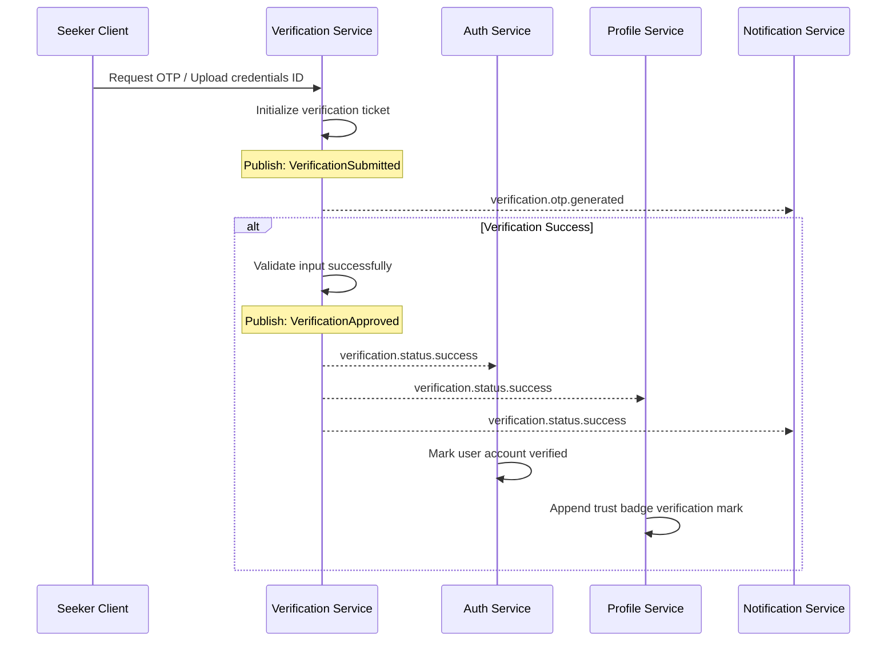

# Event Catalog — Matrimony Platform

This document catalogs the business events, producers, consumers, triggers, payloads, and event flows across the Matrimony Platform. The events defined here are immutable business facts written in the past tense.

---

## 1. Event Overview

The Matrimony Platform operates on an event-driven architecture to keep microservices decoupled. 
* **Facts in the Past Tense**: Every event indicates a business change that has already occurred (e.g. `UserRegistered`, not `RegisterUser`).
* **Immutability**: Events cannot be altered or deleted once published to the message broker (RabbitMQ/Kafka).
* **Decoupled Workflows**: Producer services publish events without knowing who consumes them. Consumer services react asynchronously to update local caches, index profiles, or send notifications.

---

## 2. Event Catalog

### User Lifecycle Events

#### 1. UserRegistered
* **Description**: A visitor successfully inputs their phone number and initiates account registration.
* **Producer Service**: Auth Service
* **Consumer Services**: Profile Service, Verification Service, Notification Service
* **Trigger**: A new registration request is saved in the authentication database.
* **Business Purpose**: Initiates verification validation checks and creates a profile stub.
* **Payload Summary**: User Account ID, Phone Number, Registration Timestamp.
* **Idempotency Requirements**: Consumers must ignore duplicates if a profile stub already exists for the User Account ID.
* **Failure Handling**: Retry 3 times. If failures persist, route to Dead-Letter Queue (DLQ) for operations auditing.

#### 2. UserVerified
* **Description**: The user completes phone/email OTP verification checks successfully.
* **Producer Service**: Verification Service
* **Consumer Services**: Auth Service, Profile Service, Notification Service
* **Trigger**: Validation check confirms correct OTP value entry.
* **Business Purpose**: Updates user verification state and unlocks the onboarding wizard.
* **Payload Summary**: User Account ID, Phone Number, Verification Type, Timestamp.
* **Idempotency Requirements**: Ensure the verification state update is idempotent; ignore subsequent verifies for already active users.
* **Failure Handling**: Retry with exponential backoff.

#### 3. UserLoggedIn
* **Description**: An authenticated user establishes an active platform session.
* **Producer Service**: Auth Service
* **Consumer Services**: Notification Service
* **Trigger**: Successful JWT token emission upon OTP check or magic link verification.
* **Business Purpose**: Logs session history and audits account logins.
* **Payload Summary**: User Account ID, Session ID, Device Info, Timestamp.
* **Idempotency Requirements**: Logging handlers append data; session key is unique.
* **Failure Handling**: Fail silently; log error locally.

#### 4. UserSuspended
* **Description**: An account is suspended due to violations or report reviews.
* **Producer Service**: Auth Service
* **Consumer Services**: Profile Service, Search Service, Notification Service
* **Trigger**: Compliance administrator triggers suspension deactivation.
* **Business Purpose**: Instantly hides profile details and halts platform matching updates.
* **Payload Summary**: User Account ID, Reason Code, Expiry Timestamp.
* **Idempotency Requirements**: Set profile state to hidden; ignore if already suspended.
* **Failure Handling**: High priority event. Retry up to 5 times. Block API access immediately.

---

### Profile Lifecycle Events

#### 5. ProfileCreated
* **Description**: A seeker completes the initial multi-step onboarding wizard.
* **Producer Service**: Profile Service
* **Consumer Services**: Search Service, Matchmaking Service
* **Trigger**: Onboarding wizard details are saved to database.
* **Business Purpose**: Adds new user details to active matching index pool.
* **Payload Summary**: Profile ID, User Account ID, Name, Gender, Location, Demographics.
* **Idempotency Requirements**: Profile ID is unique. Ignore if profile index already exists.
* **Failure Handling**: Retry with backoff.

#### 6. ProfileCompleted
* **Description**: The profile completion progress indicator reaches 100%.
* **Producer Service**: Profile Service
* **Consumer Services**: Search Service, Matchmaking Service
* **Trigger**: User uploads a primary avatar photo and fills mandatory profile settings.
* **Business Purpose**: Flags profile as eligible for active matchmaking queues and searches.
* **Payload Summary**: Profile ID, Completion Date.
* **Idempotency Requirements**: Mark target profile state as searchable.
* **Failure Handling**: Retry indexing query until successful.

#### 7. ProfileUpdated
* **Description**: The user alters profile background parameters post-onboarding.
* **Producer Service**: Profile Service
* **Consumer Services**: Search Service, Matchmaking Service
* **Trigger**: Profile modifications saved in profile dashboard.
* **Business Purpose**: Triggers updates to the search engine index for real-time search filters accuracy.
* **Payload Summary**: Profile ID, Modified Attributes list (Name, Location, Education, etc.).
* **Idempotency Requirements**: Apply partial updates using version sequencing tags.
* **Failure Handling**: Retry indexing query; log schema alignment issues.

#### 8. ProfileVisibilityChanged
* **Description**: User alters search visibility options (Public vs. Hidden).
* **Producer Service**: Profile Service
* **Consumer Services**: Search Service
* **Trigger**: Toggle visibility setting action executed.
* **Business Purpose**: Adds or removes profile details from search engine index results.
* **Payload Summary**: Profile ID, New Visibility state (Public, Private, Hidden).
* **Idempotency Requirements**: Update active state search indicator.
* **Failure Handling**: Critical for privacy. Retry instantly.

---

### Media Lifecycle Events

#### 9. PhotoUploaded
* **Description**: A new photo uploads to secure S3 storage.
* **Producer Service**: Media Service
* **Consumer Services**: Profile Service
* **Trigger**: S3 upload callback verifies photo saved.
* **Business Purpose**: Triggers profile completion calculation evaluations.
* **Payload Summary**: Photo ID, Profile ID, Image URL, Is Avatar, Visibility.
* **Idempotency Requirements**: Appends photo reference to profile.
* **Failure Handling**: Revert database index insert if uploader hook drops.

#### 10. PhotoDeleted
* **Description**: A user deletes an image from their profile grid.
* **Producer Service**: Media Service
* **Consumer Services**: Profile Service, Search Service
* **Trigger**: Deletion request executed in media manager dashboard.
* **Business Purpose**: Removes photo metadata from active matches browse cards.
* **Payload Summary**: Photo ID, Profile ID, Was Avatar flag.
* **Idempotency Requirements**: Remove photo reference; ignore if already deleted.
* **Failure Handling**: Ensure S3 asset deletion cleanup is scheduled.

#### 11. PhotoVisibilityChanged (Media level)
* **Description**: User changes visibility configurations on a specific image.
* **Producer Service**: Media Service
* **Consumer Services**: Search Service, Profile Service
* **Trigger**: Photo visibility toggle changed (e.g. Set to Matches Only).
* **Business Purpose**: Alters media blur parameters on search query browse grids.
* **Payload Summary**: Photo ID, Profile ID, New Visibility setting.
* **Idempotency Requirements**: Update visibility attributes on search model.
* **Failure Handling**: Retry updates instantly.

---

### Preferences Events

#### 12. PreferencesCreated
* **Description**: Initial partner filter settings set.
* **Producer Service**: Profile Service
* **Consumer Services**: Search Service, Matchmaking Service
* **Trigger**: Wizard preferences settings saved.
* **Business Purpose**: Sets baseline preferences filters for recommendations list.
* **Payload Summary**: Profile ID, Age bounds, Height bounds, Preferred locations/religions.
* **Idempotency Requirements**: Initialize preference records.
* **Failure Handling**: Backoff retry.

#### 13. PreferencesUpdated
* **Description**: User adjusts partner preferences in dashboard settings.
* **Producer Service**: Profile Service
* **Consumer Services**: Search Service, Matchmaking Service
* **Trigger**: Preferences slider or multi-select dropdown saved.
* **Business Purpose**: Triggers recommendations index refresh.
* **Payload Summary**: Profile ID, Updated preference parameters.
* **Idempotency Requirements**: Overwrite previous preferences settings.
* **Failure Handling**: Retry index update.

---

### Interest Lifecycle Events

#### 14. InterestSent
* **Description**: Seeker sends a connection interest request to a target profile.
* **Producer Service**: Interest Service
* **Consumer Services**: Notification Service
* **Trigger**: Click 'Send Interest' button action.
* **Business Purpose**: Queues push notification and in-app alerts for target profile.
* **Payload Summary**: Interest ID, Sender Profile ID, Receiver Profile ID, Timestamp.
* **Idempotency Requirements**: Block creation if a pending interest record already exists.
* **Failure Handling**: Log and retry.

#### 15. InterestAccepted
* **Description**: Recipient profile accepts an incoming interest request.
* **Producer Service**: Interest Service
* **Consumer Services**: Matchmaking Service, Notification Service, Chat Service
* **Trigger**: Click 'Accept' action button.
* **Business Purpose**: Formally opens mutual connection status and triggers chat conversation initialization.
* **Payload Summary**: Interest ID, Sender Profile ID, Receiver Profile ID, Timestamp.
* **Idempotency Requirements**: Ignore duplicate accept triggers if status is already MATCHED.
* **Failure Handling**: High priority. Retry transaction.

#### 16. InterestRejected
* **Description**: Recipient profile declines an incoming interest request.
* **Producer Service**: Interest Service
* **Consumer Services**: Notification Service (to suppress alerts)
* **Trigger**: Click 'Decline' action button.
* **Business Purpose**: Moves request status to Archived, suppressing future connection alerts.
* **Payload Summary**: Interest ID, Receiver Profile ID, Timestamp.
* **Idempotency Requirements**: Set interest state to ARCHIVED.
* **Failure Handling**: Fail silently to protect recipient privacy.

---

### Match Lifecycle Events

#### 17. MatchCreated
* **Description**: Mutual match object initialized.
* **Producer Service**: Matchmaking Service
* **Consumer Services**: Chat Service, Notification Service
* **Trigger**: Reacts to `interest.status.accepted` event.
* **Business Purpose**: Unlocks unmasked contact detail variables for matched profiles.
* **Payload Summary**: Match ID, Profile A Reference, Profile B Reference, Connection Date.
* **Idempotency Requirements**: Match ID is unique. Ignore duplicate matches creation.
* **Failure Handling**: Retry creation; log failures to admin dashboard.

#### 18. MatchExpired
* **Description**: Active match expires (e.g. system cleanup or deactivation de-matching).
* **Producer Service**: Matchmaking Service
* **Consumer Services**: Chat Service
* **Trigger**: Explicit disconnect action or account deletion.
* **Business Purpose**: Blocks direct messaging actions in Chat Service.
* **Payload Summary**: Match ID, Profile A ID, Profile B ID, Timestamp.
* **Idempotency Requirements**: Terminate active match parameters.
* **Failure Handling**: High priority. Lock messaging instantly.

---

### Chat Lifecycle Events

#### 19. ConversationCreated
* **Description**: Direct messaging channel initialized.
* **Producer Service**: Chat Service
* **Consumer Services**: Notification Service
* **Trigger**: Reacts to `match.created` event.
* **Business Purpose**: Prepares conversation window threads.
* **Payload Summary**: Conversation ID, Match ID, Participant A, Participant B, Timestamp.
* **Idempotency Requirements**: Check if thread already exists prior to initialization.
* **Failure Handling**: Log thread creation issues.

#### 20. MessageSent
* **Description**: A participant sends a message in a conversation thread.
* **Producer Service**: Chat Service
* **Consumer Services**: Notification Service
* **Trigger**: Click send button on chat input panel.
* **Business Purpose**: Triggers offline notifications if recipient is away.
* **Payload Summary**: Message ID, Conversation ID, Sender ID, Recipient ID, Timestamp.
* **Idempotency Requirements**: Enforce message ID checks to prevent duplicate text prints on client.
* **Failure Handling**: Store message in cache and retry database insertion.

---

### Notification Lifecycle Events

#### 21. NotificationCreated
* **Description**: A transactional warning or alert is queued.
* **Producer Service**: Notification Service
* **Consumer Services**: API Gateway (WebSocket delivery)
* **Trigger**: Fired by consumer workers responding to core lifecycles.
* **Business Purpose**: Dispatches push, email, or WebSockets warnings.
* **Payload Summary**: Notification ID, User Account ID, Channel type, Body content.
* **Idempotency Requirements**: Assign unique alert keys.
* **Failure Handling**: Retry delivery 3 times. Move to failed message queue if carrier drop occurs.

#### 22. NotificationRead
* **Description**: User views notification alert item.
* **Producer Service**: Notification Service
* **Consumer Services**: None.
* **Trigger**: User clicks alert bubble in header tray.
* **Business Purpose**: Cleans up unread alert indicators in dashboard layout.
* **Payload Summary**: Notification ID, User Account ID, Timestamp.
* **Idempotency Requirements**: Set alert state to Read.
* **Failure Handling**: Update locally; fail silently.

---

### Verification Lifecycle Events

#### 23. VerificationSubmitted
* **Description**: User submits security details or triggers registration OTP validation code dispatch.
* **Producer Service**: Verification Service
* **Consumer Services**: Notification Service
* **Trigger**: OTP check triggered or ID verification form uploaded.
* **Business Purpose**: Requests SMS/Email dispatch worker to route validation credentials.
* **Payload Summary**: Verification ID, User Account ID, Type, Timestamp.
* **Idempotency Requirements**: Log validation ticket.
* **Failure Handling**: Retry gateway trigger.

#### 24. VerificationApproved
* **Description**: Security check passes validation reviews.
* **Producer Service**: Verification Service
* **Consumer Services**: Auth Service, Profile Service, Notification Service
* **Trigger**: Correct code verify check or manual check approval.
* **Business Purpose**: Activates profile search state and appends trust badges.
* **Payload Summary**: Verification ID, User Account ID, Status code, Completion Date.
* **Idempotency Requirements**: Set account verified status to TRUE.
* **Failure Handling**: Re-publish event until database commits success.

#### 25. VerificationRejected
* **Description**: Verification fails (e.g. invalid document or expired OTP code).
* **Producer Service**: Verification Service
* **Consumer Services**: Notification Service
* **Trigger**: Validation verification fails or code lifetime expires.
* **Business Purpose**: Raises security alerts and increments lock counters.
* **Payload Summary**: Verification ID, User Account ID, Failure Reason, Fail count.
* **Idempotency Requirements**: Increment lock counters.
* **Failure Handling**: Log and notify.

---

### Subscription Lifecycle Events

#### 26. SubscriptionActivated
* **Description**: Premium membership tier is purchased.
* **Producer Service**: Subscription Service
* **Consumer Services**: Profile Service, Notification Service
* **Trigger**: Gateway payment success callback received.
* **Business Purpose**: Unlocks gated features (reveals, boosts) for subscription duration.
* **Payload Summary**: Subscription ID, User Account ID, Tier Level, Start/Renewal Dates.
* **Idempotency Requirements**: Update active billing status.
* **Failure Handling**: High priority. Retry database write with locks.

#### 27. SubscriptionExpired
* **Description**: Membership subscription period ends without renewal.
* **Producer Service**: Subscription Service
* **Consumer Services**: Profile Service, Notification Service
* **Trigger**: Cron cron scheduler deactivates expired subscription records.
* **Business Purpose**: Gates premium attributes instantly.
* **Payload Summary**: Subscription ID, User Account ID, End Timestamp.
* **Idempotency Requirements**: Reset membership level configurations.
* **Failure Handling**: Retry deactivation checks.

---

## 3. Event Producers & Consumers

This matrix maps event relations across services:

| Event Name | Producer Service | Consumer Services |
| :--- | :--- | :--- |
| `UserRegistered` | Auth Service | Profile, Verification, Notification |
| `UserVerified` | Verification Service | Auth, Profile, Notification |
| `UserLoggedIn` | Auth Service | Notification |
| `UserSuspended` | Auth Service | Profile, Search, Notification |
| `ProfileCreated` | Profile Service | Search, Matchmaking |
| `ProfileCompleted` | Profile Service | Search, Matchmaking |
| `ProfileUpdated` | Profile Service | Search, Matchmaking |
| `ProfileVisibilityChanged` | Profile Service | Search |
| `PhotoUploaded` | Media Service | Profile |
| `PhotoDeleted` | Media Service | Profile, Search |
| `PhotoVisibilityChanged` | Media Service | Search, Profile |
| `PreferencesCreated` | Profile Service | Search, Matchmaking |
| `PreferencesUpdated` | Profile Service | Search, Matchmaking |
| `InterestSent` | Interest Service | Notification |
| `InterestAccepted` | Interest Service | Matchmaking, Notification, Chat |
| `InterestRejected` | Interest Service | Notification |
| `MatchCreated` | Matchmaking Service | Chat, Notification |
| `MatchExpired` | Matchmaking Service | Chat |
| `ConversationCreated` | Chat Service | Notification |
| `MessageSent` | Chat Service | Notification |
| `NotificationCreated` | Notification Service | API Gateway |
| `NotificationRead` | Notification Service | None |
| `VerificationSubmitted` | Verification Service | Notification |
| `VerificationApproved` | Verification Service | Auth, Profile, Notification |
| `VerificationRejected` | Verification Service | Notification |
| `SubscriptionActivated` | Subscription Service | Profile, Notification |
| `SubscriptionExpired` | Subscription Service | Profile, Notification |

---

## 4. Event Flow Diagrams

### Registration Flow

### Profile Completion Flow

### Interest Flow

### Messaging Flow

### Verification Flow

---

## 5. Governance Rules

### Naming Conventions
* **Past Tense Business Facts**: All event names must strictly represent actions that have concluded. They must use PascalCase (e.g. `UserRegistered`, `PhotoDeleted`).
* **Topic Routing Format**: Routing keys on RabbitMQ message broker use format: `<entity>.<action>.<result>` (e.g., `user.profile.updated`, `interest.request.sent`).

### Versioning Strategy
* **Schema Evolution**: Event payload changes must maintain backward compatibility where possible. Adding optional fields is permitted.
* **Semantic Major Versions**: If schema changes are breaking (e.g. deleting properties, altering type parameters), create a new event version using topic routing version paths: `<entity>.<action>.<result>.v2` (e.g. `user.profile.updated.v2`).

### Event Ownership
* **Single Producer**: Exactly one microservice acts as system-of-record creator and publisher for an event. The owning service controls schema definitions.

### Retry & Dead-Letter Handling Principles
* **Exponential Backoff**: If consumers fail processing events due to temporary network issues, retry execution with exponential wait intervals (e.g., 2s, 4s, 8s).
* **Limit Retry Thresholds**: Cap consecutive retry events at `3` attempts.
* **Dead-Letter Queues (DLQ)**: If threshold is exceeded, route messages to isolated Dead-Letter Queues for operations logging and review.
