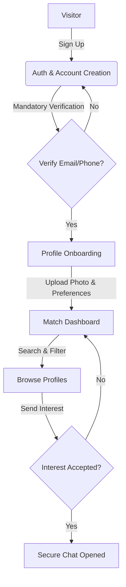

# Product Requirements Document (PRD) — Matrimony App

---

## 1. Summary

This document specifies the requirements for a modern, trust-focused matrimonial application. The application helps users find compatible partners through verified profiles, secure messaging, and intelligent matchmaking. Our primary focus is solving the "trust deficit" in current online matchmaking by ensuring profile authenticity from day one.

---

## 2. Contacts

* **Product Manager**: Antigravity (AI PM)
* **Lead Architect**: Engineering Team
* **Key Stakeholders**: Product and Engineering Leadership

---

## 3. Background

Matchmaking is a deeply personal and culturally significant process. While online matrimonial platforms are widely used, they face a major challenge: **lack of trust**. Users are frequently exposed to fake profiles, financial scams, and misrepresented details. 

Now, with advancements in facial verification, automated document checks, and AI-driven compatibility modeling, it has become possible to build a platform that guarantees authenticity. By designing a secure, verified-only matchmaking system, we can provide a safe space for people who are genuinely looking for life partners.

---

## 4. Objective

Our objective is to build a matrimonial platform where users feel safe, respected, and confident in the authenticity of every profile they interact with.

### Key Results (SMART OKRs)
* **OKR 1: Profile Authenticity**
  * *Key Result*: Achieve 95% of active user profiles verified via email, phone, and optional ID badge within 3 months of launch.
* **OKR 2: User Engagement**
  * *Key Result*: Reach a 40% response rate on sent "Interests" (connections) within the first 6 months.
* **OKR 3: Platform Trust & Safety**
  * *Key Result*: Keep reported spam/fake profiles below 1% of the total user base.

---

## 5. Market Segment(s)

We are building this app for people who have the following "jobs-to-be-done" (JTBD) and problems:

### Segment A: Serious Marriage Seekers (Independent Professionals)
* **Problem**: They have busy schedules and cannot waste time filtering through unserious or fake profiles.
* **Job to be Done**: "Help me find and connect with serious, like-minded professionals in a secure environment so I can find a life partner without stress."
* **Constraints**: High need for privacy. They do not want their profile photos or contact info visible to the general public.

### Segment B: Family-Assisted Seekers (Parents & Guardians)
* **Problem**: Parents want to help their children find matches but struggle to navigate modern online spaces and verify family background details.
* **Job to be Done**: "Help me manage my child's profile and collaborate with them to find family-approved matches."
* **Constraints**: Need simple interfaces and clear indications of family background details.

---

## 5.2 User Journey Mapping

The following matrix charts the user experience journey across the platform's lifecycle for both core user segments:

| Stage | User Action | Touchpoints | Emotional State | Pain Points & Friction | Opportunities |
| :--- | :--- | :--- | :--- | :--- | :--- |
| **1. Signup & Verification** | User submits mobile number, receives SMS OTP, enters it, and verifies their email via a magic link. | landing Page, SMS OTP Dialog, Email Client | Hopeful but cautious about privacy. | Delays in SMS delivery, entering invalid OTP codes. | Clearly highlight that mandatory checks keep the community fake-free. |
| **2. Profile Onboarding** | User completes personal, family, education, and lifestyle wizard steps; uploads 3 photos. | Onboarding Wizard (Multi-step form), Media Uploader | Anxious about presenting themselves well; concern over photo safety. | Tedious inputs, fear of public photo scraping. | Reassure that photos are blurred to unverified users by default. Auto-fill options. |
| **3. Match Discovery** | User configures partner preferences (age, location, religion) and scrolls through match recommendations. | Preferences Panel, Match Grid | Analytical, expecting curated choices. | Scrolling past irrelevant or low-quality profiles. | Highlight compatibility scores and verification badges prominent on cards. |
| **4. Expressing Interest** | User clicks "Send Interest" to express matching interest. Tracks status in connection inbox. | Profile Card CTA, Interests Dashboard | Hopeful, vulnerable to rejection. | Fear of being ignored or spammed with unwanted invites. | Restrict multiple interest requests to prevent spam. Notify immediately upon mutual match. |
| **5. Mutual Connection** | Interest accepted by both parties, unlocking a secure chat window. | Match Alert, Chat Interface | Excited, relieved to communicate. | Hesitation in sharing direct contact info (phone/email) too early. | Mask phone/email by default in the chat until users consent via "Share Contact". |

---

## 6. Value Proposition(s)

Our value proposition is centered around **Trust, Privacy, and Smart Relevance**.

```
Value / Benefit
  ^
  |                                        * Our Matrimony App
  |                         *              *
  |          *             *               *
  |         *              *               *
  |        *               *               *
  +---------------------------------------------------->
         Low Cost        Ad-Heavy       Verified-Only
      (Competitors)    (Competitors)      (Our App)
```

### Core Value Drivers:
1. **Verified Profiles First**: Unlike competitors who allow anyone to post anonymously, we highlight verified credentials (OTP, Email, and optional ID) early in the user lifecycle.
2. **Privacy by Default**: Photos and contact details are hidden until there is mutual interest.
3. **High-Intent Matching**: We prioritize compatibility and serious intent over casual "swiping".

---

## 7. Solution

The solution will be built as a decoupled React frontend communicating with microservices. 

### 7.1 User Flows



### 7.2 Key Features (Level 1 — Foundation MVP)

#### 1. User Authentication (Multiple Methods)
* **Description**: Allows users to securely register and access the platform. (Handled by the **Auth & User Service**).
* **Requirements & Expanded Acceptance Criteria**:
  * Support multiple authentication methods: Mobile OTP sign-in and Email Magic Link login.
  * Establish session management using secure JWT-based tokens (15-minute lifespan) and refresh tokens.
  * Secure account recovery via verified email address.
  * Auto-expiry of mobile OTP code after 5 minutes.
  * *Edge Case/Constraint*: If OTP verification fails 3 times, lock OTP verification for that number for 1 hour to prevent brute force. If phone number format is invalid, prevent form submission and show inline validation alerts.

#### 2. User Profile Management & Editing
* **Description**: Multi-step wizard to create and edit matrimonial profiles. (Handled by the **Profile Service**).
* **Requirements & Expanded Acceptance Criteria**:
  * Onboarding wizard capturing:
    * **Personal details**: Name, Gender, Date of Birth (must validate age >= 18), Height, Mother Tongue.
    * **Family details**: Family type (nuclear/joint), parents' occupations, family values (orthodox/moderate/liberal), and family status.
    * **Education & Career**: Degree, University, Occupation, Industry, and annual income range.
    * **Lifestyle**: Dietary choices (vegetarian/non-vegetarian), smoking/drinking habits.
  * Display a profile completion checklist with a visual "Completion Percentage" progress indicator.
  * Provide a Profile Edit Dashboard allowing users to modify details post-onboarding.
  * *Edge Case/Constraint*: A profile cannot reach 100% completion percentage unless at least one valid profile photo is uploaded. Dropdown field inputs must restrict values strictly to pre-configured option lists in the database.

#### 3. Partner Preferences
* **Description**: Allow users to configure criteria for potential matches. (Handled by the **Profile Service** & **Search Service**).
* **Requirements & Expanded Acceptance Criteria**:
  * Set ranges for Age, Height, and Income.
  * Filter attributes by Religion, Mother Tongue, and Location.
  * Preferences are stored as user metadata and actively used by the Matchmaking Engine to filter and score profiles.
  * *Edge Case/Constraint*: Preferences must validate input bounds (e.g. min age >= 18, max age <= 70). Empty preference arrays must default to showing regional recommendations.

#### 4. Profile Photos Manager
* **Description**: Upload and manage profile images. (Handled by the **Profile Service** & S3 integration).
* **Requirements & Expanded Acceptance Criteria**:
  * Support uploading multiple images (up to 5).
  * Allow users to select one image as their main "Profile Picture".
  * Implement photo privacy visibility controls (e.g. visible to all registered users, visible to accepted matches only, or fully hidden).
  * *Edge Case/Constraint*: Photos must validate image types (only `.jpg`, `.jpeg`, `.png` allowed) and maximum file size (5MB). Uploads exceeding these limits must display a user-friendly error dialog. Toggling photos to "Hidden" must instantly update the search index to remove cached versions.

#### 5. Match Discovery (Search & Filtering)
* **Description**: Allow users to find matches through active search and passive recommendations. (Handled by the **Search & Matchmaking Service**).
* **Requirements & Expanded Acceptance Criteria**:
  * Text search functionality by Profile ID or Name.
  * Basic filters: age range, religion, mother tongue, location, and education.
  * Provide 10 daily profile recommendations (Match Score > 80%) based on partner preferences.
  * *Edge Case/Constraint*: Inactive profiles (no login in 90 days) are excluded from search recommendations. Location search must support geofenced queries (e.g., within 50km radius).

#### 6. Interest Management (Send / Accept / Reject)
* **Description**: Manage double-opt-in connection requests. (Handled by the **Profile Service**).
* **Requirements & Expanded Acceptance Criteria**:
  * Allow users to send an "Interest" request to another profile.
  * Support accepting interests, which unlocks the Chat & Messaging service.
  * Support rejecting/declining interests, moving the request to an archived state.
  * Inbox to track connection states: "Received Interests", "Sent Interests", and "Accepted Matches".
  * *Edge Case/Constraint*: Senders cannot send another interest to the same user once a request is pending (button state must toggle to "Interest Sent"). When a request is rejected, the sender must not receive any notification or UI warning (to protect user privacy).

#### 7. System & Activity Notifications
* **Description**: Keep users informed of important events. (Triggered by events, delivered by the **Notification Service**).
* **Requirements & Expanded Acceptance Criteria**:
  * **Match Updates**: Notify user when high-score match recommendations are updated.
  * **Interest Updates**: In-app and push notification when an interest is received, accepted, or declined.
  * **Account Updates**: Security notifications for new sign-ins, password changes, or verification status.
  * Deliver daily email digests for match updates.
  * *Edge Case/Constraint*: In-app notifications must automatically update to a read state when clicked, and have a global "Mark All Read" action. If a user is currently active in the chat service, notifications for that active conversation are suppressed.

#### 8. Basic Privacy Controls
* **Description**: User-controlled profile protection. (Handled by the **Auth & User** and **Profile Services**).
* **Requirements & Expanded Acceptance Criteria**:
  * Profile visibility toggles (visible to all registered users vs. completely hidden from search indices).
  * Photo visibility controls (support photo blurring for unverified/unmatched users).
  * Contact information protection: absolute masking of email and phone numbers; contact details are never revealed unless mutually consented via a contact share workflow.
  * *Edge Case/Constraint*: Mashed contact details must mask characters (e.g. `jo***@email.com` and `+91******987`) directly at the server API layer, rather than styling the masking in the client.

---

### 7.3 Design System (Neumorphism / Soft UI)

#### 7.3.1 Philosophy
Neumorphism creates the illusion of physical depth through dual shadows (top-left light source, bottom-right dark shadow) on monochromatic backgrounds. Elements appear extruded (convex) or pressed (concave) from a single continuous "clay-like" surface. The visual tone is tactile, calm, and premium, utilizing a cooler grey palette to feel clean and modern.

#### 7.3.2 Design Tokens
* **Colors**:
  * **Background**: `#E0E5EC` (Cool grey base clay)
  * **Foreground Text**: `#3D4852` (High-contrast primary dark blue-grey, 7.5:1 ratio)
  * **Muted Text**: `#6B7280` (AA-compliant secondary grey, 4.6:1 ratio)
  * **Accent**: `#6C63FF` (Soft violet highlight for CTAs and focus)
  * **Accent Light**: `#8B84FF` (Secondary gradient/hover)
  * **Accent Secondary**: `#38B2AC` (Teal for success checkmarks)
* **Shadows (Core Physics)**:
  * **Extruded (Resting)**: `9px 9px 16px rgba(163, 177, 198, 0.6), -9px -9px 16px rgba(255, 255, 255, 0.5)`
  * **Extruded Hover**: `12px 12px 20px rgba(163, 177, 198, 0.7), -12px -12px 20px rgba(255, 255, 255, 0.6)`
  * **Inset (Pressed/Active)**: `inset 6px 6px 10px rgba(163, 177, 198, 0.6), inset -6px -6px 10px rgba(255, 255, 255, 0.5)`
  * **Inset Deep (Inputs/Wells)**: `inset 10px 10px 20px rgba(163, 177, 198, 0.7), inset -10px -10px 20px rgba(255, 255, 255, 0.6)`
* **Typography**:
  * **Display Heading Font**: "Plus Jakarta Sans" (extrabold, tracking-tight)
  * **Body Font**: "DM Sans" (regular/medium)
* **Radii**:
  * **Containers/Cards**: `32px`
  * **Buttons/Base**: `16px`
  * **Inner Elements**: `12px` or pill (`9999px`)

#### 7.3.3 Component Styling & Micro-interactions
* **Buttons**: Default extruded; hover slightly lifts (-1px translateY + Extruded Hover shadow); active state presses down (+0.5px translateY + Inset shadow).
* **Cards**: Heavy rounding (32px), extruded resting state, lift (-2px translateY) + hover shadow. Often contains nested inset wells (e.g. icon container inset deep) for a multi-layered clay effect.
* **Inputs**: Inset shadow by default; focus state shifts to Inset Deep with a 2px accent ring ring-2 ring-[#6C63FF] offset by 2px.
* **Transitions**: Smooth 300ms ease-out transitions for depth changes. floating effects (3s infinite loop) on ambient graphic elements.

#### 7.3.4 Layout & Spacing
* Page background is `#E0E5EC` globally.
* Use generous padding (`py-32` hero, `gap-12` grid) to give soft shadows breathing room.
* Touch targets are a minimum of 44x44px (e.g. buttons at 48px).

---

### 7.4 Technology & Infrastructure Overview

* **Frontend**: React SPA (Vite), TypeScript, HSL Hues (modern CSS), Zustand for lightweight state management.
* **Backend**: Microservices built on Node.js/Go, deployed using Docker containers.
* **API Gateway**: Handles routing and acts as the entry point.
* **Database**: PostgreSQL (user profiles, credentials), Redis (caches/sessions).
* **Messaging**: RabbitMQ or Apache Kafka for asynchronous communication between services.

---

### 7.5 Key Assumptions

1. **Assumption**: Users are willing to undergo mandatory phone/email verification during sign-up.
   * *Risk*: High drop-off rate during onboarding.
   * *Mitigation*: Keep OTP verification simple and fast, explaining the safety benefits clearly during the step.
2. **Assumption**: Users prefer chat over direct phone calls in the early stages of contact.
   * *Risk*: Users might try to bypass the platform by sharing phone numbers immediately.
   * *Mitigation*: Mask contact details and block phone number patterns in chat text during early interactions.

---

## 7.6 Analytics & KPI Tracking Requirements

The platform will capture behavioral telemetry to optimize matching algorithms and track user retention:

### 1. Primary Product KPIs
* **Verification Completion Rate**: % of signups that reach fully verified badge status.
* **Onboarding Conversion Rate**: % of verified signups completing all profile wizard steps.
* **Interest Activity Level**: Avg. number of interest requests sent per active user per week.
* **Double Opt-In Conversion Rate**: % of connection requests accepted vs. sent.
* **Report Rate**: % of active profiles flagged by other users.

### 2. Core Tracking Events
* `registration_otp_requested`: Phone number submitted for verification.
* `registration_verified`: OTP verified successfully.
* `onboarding_wizard_step`: Fired when steps 1, 2, or 3 of profile configuration are saved.
* `profile_photo_saved`: Photo successfully uploaded to storage.
* `match_recommendations_served`: List of matches returned to user.
* `interest_action`: Action sent (`Interest_Sent`, `Interest_Accepted`, `Interest_Declined`).
* `chat_message_sent`: Messaging engagement tracker.

---

## 8. Release Plan

```
MVP (Level 1)          Phase 2 (Level 2 & 3)       Phase 3 (Level 4 & 5)
+-------------------+  +------------------------+  +------------------------+
| - OTP Sign-in     |  | - Advanced Filters     |  | - ID/Selfie Verification|
| - Profile Creation|  | - Saved Searches       |  | - Video/Voice Calling  |
| - Match Discovery |  | - In-app Messaging     |  | - AI Match Assistant   |
| - Send Interest   |  | - Subscriptions        |  | - Wedding Marketplace  |
+-------------------+  +------------------------+  +------------------------+
   Today                 Month 3–6                   Month 6–12
```

* **Version 1.0 (Level 1 MVP — Target: 8 Weeks)**:
  * Complete core sign-up, profile setup, preferences, search, and interest exchange.
* **Version 2.0 (Trust & Premium — Target: Month 3-6)**:
  * In-app messaging, email/phone verification badges, advanced filtering, saved searches, and initial subscription billing.
* **Version 3.0 (Rich Interaction & AI — Target: Month 6-12)**:
  * Selfie verification, video profiles, secure voice calling, and AI-driven match insights.

---

## 9. Detailed Backlog Summary

A structured backlog matching the project metadata contracts is maintained in [backlog.json](file:///Users/sujaypatil/Documents/Anitgravity/MatrimonyApp/backlog.json). 

* **Active Initiative**: `INIT-001` (Build Matrimony Platform)
* **Epics**: 
  * `EPIC-001` (Level 1 Foundation MVP) — Establishes core onboarding, verification, and match discovery.
  * `EPIC-002` to `EPIC-005` — Tracks post-MVP release phases.
* **Level 1 MVP Stories**:
  * `STORY-001`: Mobile OTP Signup UI & API (High priority, 5 Story Points)
  * `STORY-002`: Email Magic Link Login (Medium priority, 3 Story Points)
  * `STORY-003`: Personal & Family Details Form Wizard (High priority, 5 Story Points)
  * `STORY-004`: Career, Education & Lifestyle Form (High priority, 3 Story Points)
  * `STORY-005`: Profile Edit Dashboard (Medium priority, 5 Story Points)
  * `STORY-006`: Partner Preferences Settings (High priority, 3 Story Points)
  * `STORY-007`: Profile Photo Upload & Set Avatar (High priority, 5 Story Points)
  * `STORY-008`: Match Discovery & Filtering UI (High priority, 5 Story Points)
  * `STORY-009`: Send, Accept & Decline Interest UI Flow (High priority, 5 Story Points)
  * `STORY-010`: Default Contact Details Masking (High priority, 3 Story Points)
* **Immediate Sprint Tasks**:
  * `TASK-001` & `TASK-002`: PostgreSQL schemas setup and OTP endpoint implementation.
  * `TASK-003`: Building Neumorphic auth component UI.
  * `TASK-004`: Onboarding form components.
  * `TASK-005`: Elasticsearch search sync listener.
