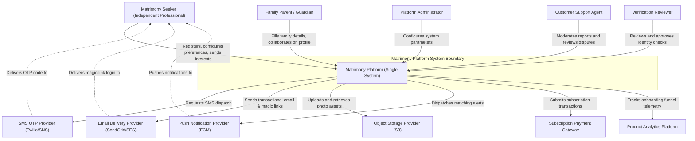

# System Context Diagram — Matrimony Platform

This document describes the high-level system boundaries, actors, external integrations, and interactive relationships for the Matrimony Platform. This corresponds to the **C4 Model Level 1 Context Diagram**, representing the platform as a single black box.

---

## 1. Context Overview

The Matrimony Platform is a trust-focused matrimonial solution that helps serious seekers locate partners through verified profiles. This document identifies the platform boundary, showing how seekers, admins, and support teams interact with the platform, and detailing how the platform integrates with third-party verification, messaging, storage, and payment networks.

---

## 2. Actor Catalog

### Primary Actors
* **Matrimony User (Independent Professional)**: Genuine seeker looking for a life partner. Focuses on privacy, profile verification, and filtering matches.
* **Family-Assisted User (Parents/Guardians)**: Parents search and filter family-approved matches for their children, collaborating via shared profile configurations.
* **Platform Administrator**: Internal administrator managing user access, security controls, and configurations.
* **Customer Support Agent**: Internal agent reviewing disputes, managing reported profiles, and addressing user queries.

### Secondary Actors
* **Verification Reviewer**: Compliance specialist verifying uploaded government documents and approving trust badges.
* **Marketing Team**: Internal users analyzing telemetry to optimize campaigns and user signups.
* **Operations Team**: Internal engineers monitoring uptime, SLAs, container scaling, and database backups.

---

## 3. External Systems Catalog

### Authentication Providers
* **SMS OTP Provider (Twilio/AWS SNS)**: Dispatches verification codes during phone registration and login checks.
* **Email Delivery Provider (SendGrid/Amazon SES)**: Routes magic links and transaction emails.

### Storage Systems
* **Object Storage Provider (Amazon S3)**: Hosts raw image uploads and delivers blurred photo placeholders for privacy.

### Notification Providers
* **Push Notification Provider (FCM/APNS)**: Delivers real-time interest updates and matching alerts.

### Payment Providers
* **Subscription Payment Gateway (Stripe/PayPal)**: Processes subscription payments and handles upgrades.

### Analytics Providers
* **Product Analytics Platform (Mixpanel/Amplitude)**: Captures user telemetry to analyze onboarding conversions and funnel drop-offs.

---

## 4. Interaction Matrix

Below are the high-level data flows across the system boundary:

| Actor/System | Interaction | Data Exchanged | Frequency | Business Purpose |
| :--- | :--- | :--- | :--- | :--- |
| **Matrimony User** | Register Account | Phone Number, Email | High | Account creation and verification setup. |
| **Matrimony User** | Complete Profile | Personal, educational, and lifestyle details | High | Onboarding and match criteria setup. |
| **Matrimony User** | Manage Photos | Image uploads | High | Profile picture customization. |
| **Matrimony User** | Express Interest | Interest send/accept actions | High | Double opt-in matching connections. |
| **Family-Assisted User** | Manage Family Profile | Parent background details | Medium | Collaborative profile management. |
| **Platform Administrator**| Configure System Rules | System config, lookup data | Low | Security and compliance tuning. |
| **Customer Support Agent**| Resolve Reports | Profile status overrides, reports | Medium | Platform moderation. |
| **Verification Reviewer** | Verify Documents | Identity check approvals/rejections | Medium | Authenticating verified trust badges. |
| **SMS OTP Provider** | Send Verification SMS | 6-digit OTP code | High | Phone number verification. |
| **Email Delivery Provider** | Deliver Emails | Magic links, digest summaries | High | Passwordless login and notifications. |
| **Object Storage Provider** | Host Photo Assets | Media files uploads | High | Media asset hosting. |
| **Notification Provider** | Deliver Push Notifications | App notifications payloads | High | Out-of-app updates. |
| **Payment Gateway** | Process Payments | Subscription fees, billing callbacks | Medium | Upgrades and monetization. |
| **Analytics Platform** | Track Telemetry | Event names, user attributes | High | Product metrics tracking. |

---

## 5. System Context Diagram (Mermaid)

---

## 6. Assumptions

1. **User Ownership**: Users own mobile numbers and can receive SMS OTP codes for registration checks.
2. **Third-Party Availability**: External gateways (Twilio, SendGrid, S3) meet availability SLAs, preventing user onboarding blocks.
3. **Privacy Compliance**: Media assets stored in object storage are private, allowing CDN presigned URLs for blurring controls.

---

## 7. Risks

1. **OTP SMS Delivery Failure**:
   - *Risk*: Network issues block OTP SMS delivery, blocking signups.
   - *Mitigation*: Enable email magic links as an instant fallback during verification checks.
2. **CDN Photo Scraping**:
   - *Risk*: Script bots scrape CDN URLs to copy profile images.
   - *Mitigation*: Limit presigned S3 URLs to a 15-minute expiration window and blur images for unmatched requests.
