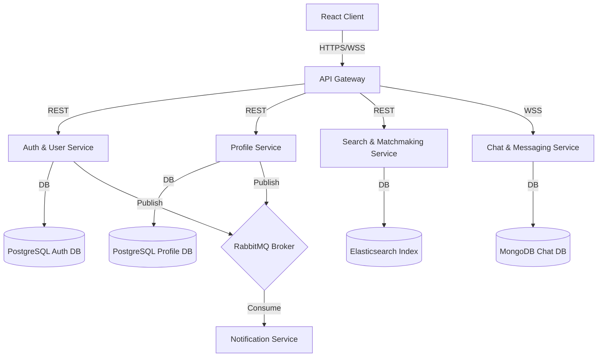

# Application Design Document — MatrimonyApp

---

# 1. Project Overview

## Application Name

```text
MatrimonyApp
```

## Short Description

```text
A modern, trust-focused matrimonial application designed to help serious marriage seekers find life partners. The platform ensures high-quality connections through verified profiles, smart compatibility scoring, and secure messaging.
```

## Current Development Phase

```text
Architecture & Planning
```

## Current Status

```text
🚧 Product Roadmaps Complete
🚧 PRD Generated
🚧 High-Level Architecture Completed
❌ Database Schema Implementation (Not Started)
❌ Frontend Boilerplate (Not Started)
❌ Backend Services Code (Not Started)
```

---

# 2. Product Vision

## Goal

```text
To establish a premium, secure matrimonial platform where 100% of communication happens between verified, high-intent individuals.
```

## Success Criteria

```text
- Core verification rate of active users exceeds 95% in target markets.
- Initial user match engagement response rate is above 40%.
- Zero reported data leaks or major catfishing incidents in the first year of operation.
```

## Target Users

```text
- Independent professionals (ages 24-38) looking for serious commitments.
- Parents seeking culturally verified matches for their children in structured, shared-control environments.
```

## Business Value

```text
- Addresses the critical safety and verification gap in standard matrimonial apps.
- Monetizable through premium subscriptions, profile boosts, contact reveals, and partner verification services.
```

---

# 3. Functional Requirements

## Core Features

### 1. OTP & Email Verification Onboarding
* **Purpose**: Establish user authenticity at signup.
* **User Actions**: User submits phone number/email, enters OTP, and clicks verification link.
* **Expected Outcome**: Account verified; user details saved; onboarding profile wizard unlocked.

### 2. Matching Preference Dashboard
* **Purpose**: Define partner search criteria.
* **User Actions**: Set preferences for age, height, community, language, diet, and location.
* **Expected Outcome**: Match Discovery engine filters and ranks matches based on this configuration.

### 3. Mutual Interest Exchange
* **Purpose**: Enable double-opt-in communication.
* **User Actions**: Send an "Interest" request to another user; Accept or Decline incoming requests.
* **Expected Outcome**: Once mutually accepted, secure real-time messaging is unlocked.

---

# 4. Non-Functional Requirements

## Performance & Latency Targets
* **REST APIs**: Response latency (p95) < 100ms for read/write requests at API Gateway level.
* **WebSocket message delivery latency**: < 50ms from message dispatch to receiver receipt.
* **Search queries execution**: < 150ms in Elasticsearch for geolocation and multi-attribute filters.
* **OTP delivery**: SMS dispatch gateway trigger must complete in < 2 seconds, with carrier delivery < 10 seconds.

## Scalability & Capacity Planning
* **Stateless Microservices**: Scaled horizontally via Kubernetes HPA (Horizontal Pod Autoscaler) based on CPU utilization (>70%) and Memory limits (>80%).
* **Database Scaling**: 
  * PostgreSQL (Auth & Profile databases) implements Master-Slave architecture (1 Write master, 2 Read replicas per database) to balance read-heavy profile discovery.
  * MongoDB (Chat) scales using a sharded cluster partitioning by `conversation_id` hash.
  * Elasticsearch (Search) operates with 3-node cluster containing 1 primary shard and 1 replica shard per index.

## Availability & Recovery SLAs
* **System Uptime**: 99.9% availability per month.
* **Recovery Point Objective (RPO)**: < 1 hour (daily backups to isolated secure storage, hourly transaction log replication).
* **Recovery Time Objective (RTO)**: < 4 hours for recovery of active transactional databases.

## Maintainability & Quality Gates
* Code coverage targets are strictly enforced: >80% code coverage on unit test suites before PR approval.
* Static code analysis (ESLint/SonarQube) must return zero critical or high-risk findings.

---

# 5. Architecture Overview

## Architecture Style

```text
Microservices Architecture
```

## High-Level Architecture

```text
               +----------------------------------------+
               |               React Client             |
               +-------------------+--------------------+
                                   | HTTP/WebSockets
                                   v
               +-------------------+--------------------+
               |             API Gateway / BFF          |
               +--+------------+------------+--------+--+
                  |            |            |        |
    +-------------+            |            |        +-------------+
    v                          v            v                      v
+---+----------+  +------------+--+  +------+------+        +------+------+
| Auth & User  |  |    Profile    |  | Search &    |        | Notification|
| Service      |  |    Service    |  | Matchmaking |        | Service     |
+---+----------+  +------------+--+  +------+------+        +------+------+
    |                          |            |                      |
    | Database-per-service     |            |                      |
    v                          v            v                      v
+---+----------+  +------------+--+  +------+------+        +------+------+
| PostgreSQL   |  | PostgreSQL    |  |Elasticsearch|        | Redis Queue |
| (Auth/Users) |  | (Profile DB)  |  | (Indices)   |        |             |
+---+----------+  +------------+--+  +------+------+        +------+------+
    |                          |            ^                      |
    +--------------------------+------------+----------------------+
                       RabbitMQ Event Bus (Async Communication)
```

---

# 6. Technology Stack

## Frontend

```text
Framework: React 18+ (SPA with Vite)
Language: TypeScript
State Management: Zustand
UI Library: Tailwind CSS & Custom HSL variables
API Client: TanStack Query (React Query) + Axios
WebSockets: Socket.io-client
```

## Backend

```text
Language: TypeScript (Node.js/Express) or Go
Framework: Express (Node) or Gin (Go)
Build Tool: npm / Go Modules
Communication: REST (synchronous), gRPC (service-to-service), RabbitMQ (asynchronous)
```

## Database

```text
Primary Database: PostgreSQL (Relational consistency for users, profiles, and transactions)
Document DB: MongoDB (For storing chat histories and messaging metadata)
Cache: Redis (JWT blacklisting, user sessions, OTP validation)
Search: Elasticsearch (High-performance geolocation and attribute search indexing)
```

## Messaging

```text
RabbitMQ (Lightweight, reliable message broker for asynchronous event delegation)
```

## Infrastructure

```text
Containerization: Docker
Orchestration: Kubernetes (GKE / EKS)
Cloud Storage: AWS S3 or Google Cloud Storage (Photo hosting with signed URLs)
CDN: Cloudflare / AWS CloudFront
```

---

# 7. System Components & Service Boundaries

Our platform is divided into five distinct microservices and an API Gateway. Each backend service operates with full database isolation.



### 1. API Gateway (BFF Layer)
* **Purpose**: acts as the single entry point for all client requests, routing traffic and enforcing security.
* **Responsibilities**: REST endpoint routing, SSL termination, JWT authentication verification, API rate limiting, and CORS headers.
* **Database**: None. (Maintains temporary in-memory route configuration).

### 2. Auth & User Service
* **Purpose**: Coordinates user identity, credentials, registration, and sessions.
* **Responsibilities**: Signup/login flow, password hashing, SMS/email OTP generation, and token emission.
* **Database**: PostgreSQL (`auth_db` for credentials), Redis (`session_db` for OTP token TTL checks).

### 3. Profile Service
* **Purpose**: Manages matrimonial profile parameters, onboarding checklist status, and connection statuses.
* **Responsibilities**: Profile wizard CRUD, preference range updates, connection request states (Interest sent, accepted, rejected).
* **Database**: PostgreSQL (`profile_db` for users profiles).

### 4. Search & Matchmaking Service
* **Purpose**: Delivers fast, geofenced profile query searches and recommended matches.
* **Responsibilities**: Ingesting profile updates, querying location-based filters, and recommending matches.
* **Database**: Elasticsearch (`matches_index` of denormalized active profile structures).

### 5. Chat & Messaging Service
* **Purpose**: Facilitates direct real-time communication between matched connections.
* **Responsibilities**: Managing active WebSocket connections, message persistence, and read receipt updates.
* **Database**: MongoDB (`chat_db` for message threads).

### 6. Notification Service
* **Purpose**: Delivers transactional SMS, push notifications, and emails.
* **Responsibilities**: Dispatching alerts triggered by platform updates.
* **Database**: Redis (temporary email and SMS queue backlogs).

---

# 8. Domain Model & Entities

```
+------------------+          +------------------+          +--------------------+
|   UserAccount    | 1      1 |   UserProfile    | 1      1 | PartnerPreference  |
|------------------|----------|------------------|----------|--------------------|
| id: UUID         |          | id: UUID         |          | id: UUID           |
| email: String    |          | user_id: UUID    |          | profile_id: UUID   |
| phone: String    |          | name: String     |          | min_age: Integer   |
| password: String |          | gender: Enum     |          | max_age: Integer   |
| is_verified: Bool|          | religion: String |          | min_height: Float  |
| created_at: Date |          | occupation:String|          | max_height: Float  |
+------------------+          | location: Point  |          | religion: Array    |
                              +--------+---------+          | languages: Array   |
                                       | 1                  | locations: Array   |
                                       |                    +--------------------+
                                       | *
                              +--------v---------+
                              |   ProfilePhoto   |
                              |------------------|
                              | id: UUID         |
                              | url: String      |
                              | is_avatar: Bool  |
                              | visibility: Enum |
                              +------------------+
```

---

# 9. API Design & Contracts

All requests must set Content-Type header to `application/json` and attach a valid JWT bearer token in the `Authorization` header where authenticated.

### 1. Send SMS OTP
* **Endpoint**: `POST /api/v1/auth/otp/send`
* **Authentication**: Public
* **Request**:
```json
{
  "phone_number": "+919876543210"
}
```
* **Success Response (200 OK)**:
```json
{
  "success": true,
  "message": "OTP sent successfully."
}
```
* **Error Response (400 Bad Request)**:
```json
{
  "code": "INVALID_PHONE_NUMBER",
  "message": "The phone number format is invalid.",
  "details": "Mobile phone number must include country code and comply with E.164 standard."
}
```

### 2. Verify SMS OTP & Sign In
* **Endpoint**: `POST /api/v1/auth/otp/verify`
* **Authentication**: Public
* **Request**:
```json
{
  "phone_number": "+919876543210",
  "otp": "654321"
}
```
* **Success Response (200 OK)**:
```json
{
  "success": true,
  "accessToken": "eyJhbGciOiJIUzI1NiIsIn...",
  "refreshToken": "rT_983172hgasd...",
  "expiresIn": 900
}
```
* **Error Response (401 Unauthorized)**:
```json
{
  "code": "OTP_VERIFICATION_FAILED",
  "message": "Invalid or expired OTP code provided.",
  "details": "The OTP has expired or does not match."
}
```

### 3. Save Profile Onboarding Data
* **Endpoint**: `POST /api/v1/profiles/onboard`
* **Authentication**: Bearer JWT Required
* **Request**:
```json
{
  "name": "Arjun Patel",
  "gender": "Male",
  "date_of_birth": "1998-04-12",
  "height_cm": 178.5,
  "mother_tongue": "Gujarati",
  "religion": "Hindu",
  "family_details": {
    "family_type": "Joint",
    "parents_occupations": "Business Owner",
    "family_status": "Upper Middle Class",
    "family_values": "Moderate"
  },
  "education_career": {
    "highest_degree": "B.Tech Computer Science",
    "university": "IIT Bombay",
    "occupation": "Software Engineer",
    "industry": "Technology",
    "annual_income_range": "15L - 20L"
  },
  "lifestyle": {
    "diet": "Vegetarian",
    "smoking_habits": "Never",
    "drinking_habits": "Never"
  }
}
```
* **Success Response (201 Created)**:
```json
{
  "success": true,
  "profileId": "7f654b2a-192a-4c28-98e3-dae93231f241",
  "completionPercentage": 75
}
```

### 4. Search and Filter Profiles
* **Endpoint**: `GET /api/v1/matches/search`
* **Authentication**: Bearer JWT Required
* **Query Parameters**:
  * `ageMin`: `24`
  * `ageMax`: `30`
  * `religion`: `Hindu`
  * `location`: `Mumbai`
  * `radiusKm`: `50`
* **Success Response (200 OK)**:
```json
{
  "success": true,
  "results": [
    {
      "profileId": "8e364e52-123b-4871-bc01-dae93231f241",
      "name": "Anjali Sharma",
      "age": 28,
      "location": "Mumbai",
      "distanceKm": 12.4,
      "avatarUrl": "https://cdn.matrimony.app/photos/blurred_sharma.jpg",
      "isVerified": true,
      "matchScore": 92
    }
  ]
}
```

### 5. Send Connection Interest
* **Endpoint**: `POST /api/v1/interests`
* **Authentication**: Bearer JWT Required
* **Request**:
```json
{
  "targetProfileId": "8e364e52-123b-4871-bc01-dae93231f241",
  "action": "SEND"
}
```
* **Success Response (200 OK)**:
```json
{
  "success": true,
  "connectionStatus": "PENDING"
}
```

---

# 10. Database Design & Schemas

## 1. PostgreSQL Schema (Auth & Profile databases)

```sql
-- Auth Service Table
CREATE TABLE user_accounts (
    id UUID PRIMARY KEY DEFAULT gen_random_uuid(),
    email VARCHAR(255) UNIQUE NOT NULL,
    phone_number VARCHAR(20) UNIQUE NOT NULL,
    password_hash VARCHAR(255) NOT NULL,
    is_verified BOOLEAN DEFAULT FALSE,
    created_at TIMESTAMP WITH TIME ZONE DEFAULT CURRENT_TIMESTAMP,
    updated_at TIMESTAMP WITH TIME ZONE DEFAULT CURRENT_TIMESTAMP
);

-- Profile Service Tables
CREATE TABLE user_profiles (
    id UUID PRIMARY KEY DEFAULT gen_random_uuid(),
    user_id UUID UNIQUE NOT NULL REFERENCES user_accounts(id) ON DELETE CASCADE,
    name VARCHAR(100) NOT NULL,
    gender VARCHAR(10) NOT NULL,
    date_of_birth DATE NOT NULL,
    height_cm DECIMAL(5,2) NOT NULL,
    mother_tongue VARCHAR(50) NOT NULL,
    religion VARCHAR(50) NOT NULL,
    family_type VARCHAR(20),
    parents_occupations VARCHAR(100),
    family_status VARCHAR(50),
    family_values VARCHAR(20),
    highest_degree VARCHAR(100),
    university VARCHAR(150),
    occupation VARCHAR(100),
    industry VARCHAR(100),
    annual_income_range VARCHAR(50),
    diet VARCHAR(20),
    smoking_habits VARCHAR(20),
    drinking_habits VARCHAR(20),
    completion_percentage INT DEFAULT 0,
    created_at TIMESTAMP WITH TIME ZONE DEFAULT CURRENT_TIMESTAMP
);

CREATE TABLE partner_preferences (
    id UUID PRIMARY KEY DEFAULT gen_random_uuid(),
    profile_id UUID UNIQUE NOT NULL REFERENCES user_profiles(id) ON DELETE CASCADE,
    min_age INT DEFAULT 18,
    max_age INT DEFAULT 70,
    min_height DECIMAL(5,2),
    max_height DECIMAL(5,2),
    religions VARCHAR(50)[],
    languages VARCHAR(50)[],
    locations VARCHAR(100)[]
);

CREATE TABLE profile_photos (
    id UUID PRIMARY KEY DEFAULT gen_random_uuid(),
    profile_id UUID NOT NULL REFERENCES user_profiles(id) ON DELETE CASCADE,
    photo_url VARCHAR(255) NOT NULL,
    is_avatar BOOLEAN DEFAULT FALSE,
    visibility VARCHAR(20) DEFAULT 'PUBLIC' -- PUBLIC, ACCEPTED_ONLY, HIDDEN
);
```

## 2. MongoDB Schema (Chat & Messaging database)

```json
// Conversations Collection
{
  "_id": "ObjectId('60c72b2f9b1d8e234c000001')",
  "participants": [
    "7f654b2a-192a-4c28-98e3-dae93231f241",
    "8e364e52-123b-4871-bc01-dae93231f241"
  ],
  "created_at": "2026-06-21T18:10:51Z",
  "updated_at": "2026-06-21T18:15:30Z"
}

// Messages Collection
{
  "_id": "ObjectId('60c72b2f9b1d8e234c000002')",
  "conversation_id": "ObjectId('60c72b2f9b1d8e234c000001')",
  "sender_id": "7f654b2a-192a-4c28-98e3-dae93231f241",
  "message_text": "Hello! Nice connecting with you.",
  "is_read": false,
  "created_at": "2026-06-21T18:12:00Z"
}
```

## 3. Elasticsearch Mapping (Search Service)

```json
{
  "mappings": {
    "properties": {
      "profileId": { "type": "keyword" },
      "gender": { "type": "keyword" },
      "age": { "type": "integer" },
      "height_cm": { "type": "float" },
      "religion": { "type": "keyword" },
      "mother_tongue": { "type": "keyword" },
      "occupation": { "type": "text" },
      "location": { "type": "geo_point" },
      "completion_percentage": { "type": "integer" },
      "is_verified": { "type": "boolean" }
    }
  }
}
```

---

# 11. Event Design & RabbitMQ Payloads

Asynchronous events are dispatched on a RabbitMQ `topic` exchange named `matrimony.events`.

```text
   Auth Service                    Profile Service               Profile Service
       |                                |                             |
       | Publish 'user.auth.created'    | Publish                     | Publish
       |                                | 'user.profile.updated'      | 'match.interest.accepted'
       v                                v                             v
+------+--------------------------------+-----------------------------+---------+
|                                RabbitMQ Broker                                 |
+------+--------------------------------+-----------------------------+---------+
       |                                |                             |
       | Route                          | Route                       | Route
       v                                v                             v
+------v--------+                +------v-------+              +------v--------+
| profile.init  |                | search.sync  |              | chat.init     |
| queue         |                | queue        |              | queue         |
+---------------+                +--------------+              +---------------+
```

### 1. User Created Event
* **Routing Key**: `user.auth.created`
* **Producer**: Auth & User Service
* **Consumers**: Profile Service (initiates record), Notification Service (dispatches email magic link)
* **Payload Structure**:
```json
{
  "eventId": "evt_01h2a938fs91b82j3k20",
  "timestamp": "2026-06-21T18:37:26Z",
  "userId": "d7b2123a-f11a-4c28-bb01-dae93231f241",
  "phone": "+919876543210",
  "email": "arjun@example.com"
}
```

### 2. Profile Updated Event
* **Routing Key**: `user.profile.updated`
* **Producer**: Profile Service
* **Consumers**: Search & Matchmaking Service (re-indexes document in Elasticsearch)
* **Payload Structure**:
```json
{
  "eventId": "evt_01h2a938fs91b82j3k21",
  "timestamp": "2026-06-21T18:39:10Z",
  "profileId": "7f654b2a-192a-4c28-98e3-dae93231f241",
  "gender": "Male",
  "age": 28,
  "height_cm": 178.5,
  "religion": "Hindu",
  "mother_tongue": "Gujarati",
  "location": {
    "lat": 19.0760,
    "lon": 72.8777
  },
  "isVerified": true
}
```

### 3. Match Interest Accepted Event
* **Routing Key**: `match.interest.accepted`
* **Producer**: Profile Service
* **Consumers**: Chat Service (initializes chat conversation document), Notification Service
* **Payload Structure**:
```json
{
  "eventId": "evt_01h2a938fs91b82j3k22",
  "timestamp": "2026-06-21T18:41:00Z",
  "senderProfileId": "7f654b2a-192a-4c28-98e3-dae93231f241",
  "receiverProfileId": "8e364e52-123b-4871-bc01-dae93231f241"
}
```

---

# 12. Security Design & Policies

### 1. Authentication token Layout (JWT)
Access Tokens are encrypted using HS256 with claims including:
* **Subject (`sub`)**: User ID
* **Roles (`roles`)**: `["USER"]` or `["ADMIN"]`
* **Profile Verification Status (`is_verified`)**: Boolean flag.
Refresh Tokens are stored in HTTP-Only cookies with rotation rules to mitigate XSS risks.

### 2. Data Masking Policy
To prevent scraping and unsolicited contacts:
* API Gateway filters all profile fetch payloads. Unless a connection record with status `MATCHED` exists between the requester and the target user, the values of `phone_number` and `email` properties are hard-masked (`***`) at the gateway service boundary.
* Unmatched search result requests serve blurred photo urls hosted on separate cached CDN endpoints.

### 3. Media signed URL Strategy
* Raw photo buckets are completely private. Photos are requested via signed URLs generated on-the-fly by the Media service, having a maximum expiration TTL of 15 minutes.

---

# 13. Caching Strategy

* **Cache Layer**: Redis.
* **Usage**: Storing temporary OTP codes (5 min TTL), session tokens (15 min TTL), and hot search recommendation lists.

---

# 14. External Integrations

* **SMS Gateway**: Twilio / AWS SNS for OTP delivery.
* **Email Provider**: SendGrid / Amazon SES for transactional emails.
* **Cloud Storage**: AWS S3 for hosting profile photos (accessed via secure CloudFront signed URLs).

---

# 15. Error Handling Strategy

* **Standard Error Format**:
```json
{
  "code": "AUTH_FAILED",
  "message": "Invalid credentials provided.",
  "details": "The password hash check failed."
}
```

---

# 16. Monitoring & Observability

* **Metrics**: Prometheus for application metrics; Grafana dashboards.
* **Logging**: ELK Stack (Elasticsearch, Logstash, Kibana) for centralized logging.
* **Tracing**: OpenTelemetry integration.

---

# 17. Deployment Architecture

* **Environments**: Local (Dev), Staging, Production.
* **Deployment System**: Kubernetes pods managed using Helm charts.
* **Scaling**: Horizontal Pod Autoscaler (HPA) triggers scaling based on CPU and memory thresholds.

---

# 18. Code Structure

```text
project-root
├── gateway/          # API Gateway service
├── services/         # Microservices
│   ├── auth/         # Auth Service
│   ├── profile/      # Profile Service
│   ├── search/       # Search Service
│   └── chat/         # Chat Service
└── web-client/       # React SPA Frontend
```

---

# 19. Design Decisions Log

### Decision: Database-Per-Service Pattern
* **Date**: 2026-06-21
* **Reason**: Decoupling database storage prevents data layer single-point-of-failure and allows choosing the optimal database engine (e.g. PostgreSQL for accounts, MongoDB for chat).
* **Impact**: Service boundaries are hard-enforced. Joins across profiles and auth details must occur via API aggregation or async events.

---

# 20. Known Constraints

* **GDRP/DPDP Compliance**: Matrimonial sites hold sensitive personal attributes. Users must be able to permanently delete their profiles and associated chat records.

---

# 21. Risks

* **Risk**: Low liquidity of users in the initial launch region.
* **Mitigation**: Launch GTM strategy targeting specific community niches first to build matching density.

---

# 22. Testing Strategy

* **Unit Tests**: Mock external databases and messaging systems. Target >80% code coverage.
* **Integration Tests**: Verify RabbitMQ event flows across services.