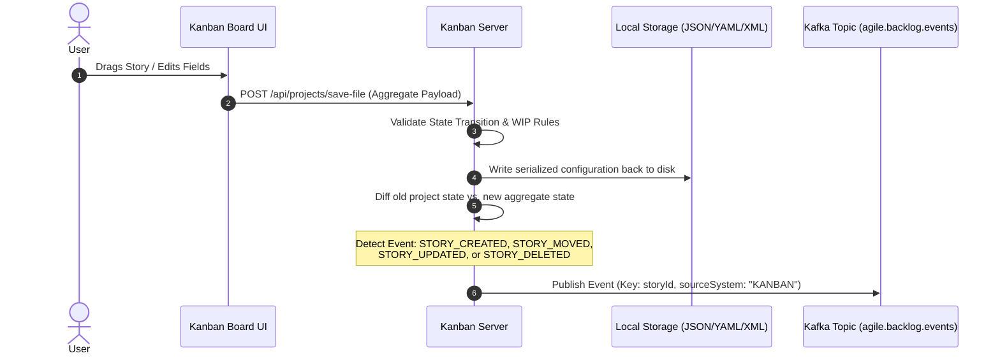
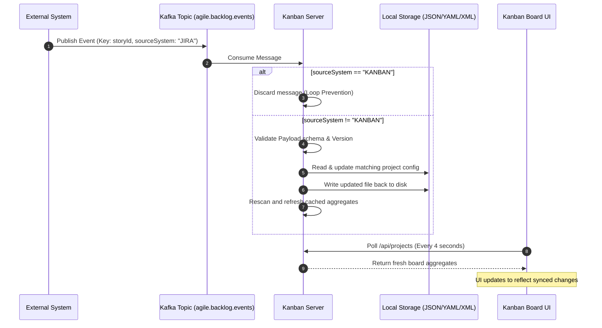

# Kanban Board Service — Kafka Integration Specification

This document defines the technology-agnostic integration contract for Kafka-based communication between the Kanban Board service and external applications (e.g., Jira, Azure DevOps, or in-house trackers). It ensures event-driven, bidirectional synchronization of board stories while maintaining system reliability, message ordering, and loop prevention.

---

## 1. System Topology & Topic Conventions

### 1.1 Topic Naming Convention
To support standard governance and multi-environment isolation, all topics must follow this naming pattern:
`[env].[domain].[resource].[category]`

For this integration, the canonical topics are:

| Environment | Topic Name | Description |
|---|---|---|
| Development | `dev.agile.backlog.events` | Publishes backlog/story state mutations. |
| Staging | `staging.agile.backlog.events` | Publishes backlog/story state mutations. |
| Production | `prod.agile.backlog.events` | Publishes backlog/story state mutations. |

### 1.2 Message Keying & Ordering
To guarantee that mutations are processed sequentially and in the order they occurred, all messages **must** use the `storyId` as the Kafka message key. 
- Using the `storyId` ensures that all events for a specific story are routed to the same partition, guaranteeing order of delivery within that partition.

---

## 2. Event Flows & Sequence Diagrams

### 2.1 Publish Flow: User Action on Kanban Board UI

When a user modifies a story on the Kanban Board UI, the local storage is updated, and a corresponding change event is dispatched to Kafka.



### 2.2 Consume Flow: Incoming Sync from External System

When an external system publishes an event, the Kanban Server consumes it, validates the source, applies the changes to the local files, and refreshes the cached aggregates.



---

## 3. Metadata & Event Schema Contracts

All messages published to the Kafka topic must conform to a generic wrapper containing mandatory metadata fields and a polymorphic `payload` object.

### 3.1 Mandatory Metadata Fields

Every message envelope must define:

| Field Name | Type | Description | Example |
|---|---|---|---|
| `eventId` | `string (UUID)` | Unique identifier for de-duplication. | `"4fa4bf92-ca08-410a-ae83-65d214ee6bcf"` |
| `eventType` | `string` | Event type: `STORY_CREATED`, `STORY_UPDATED`, `STORY_DELETED`, `STORY_MOVED`. | `"STORY_MOVED"` |
| `eventVersion` | `integer` | Schema version indicator. Must be `1`. | `1` |
| `timestamp` | `string (ISO-8601)` | Precise timestamp in UTC. | `"2026-06-22T01:00:59.123Z"` |
| `sourceSystem` | `string` | System originating the change (e.g. `KANBAN`, `JIRA`, `ADO`). | `"KANBAN"` |
| `correlationId` | `string` | Identifier to trace transactional context across systems. | `"tx-88392-alpha"` |

---

### 3.2 Canonical JSON Schema (Draft-07)

```json
{
  "$schema": "http://json-schema.org/draft-07/schema#",
  "title": "KanbanBacklogEvent",
  "type": "OBJECT",
  "required": [
    "eventId",
    "eventType",
    "eventVersion",
    "timestamp",
    "sourceSystem",
    "correlationId",
    "projectId",
    "storyId",
    "payload"
  ],
  "properties": {
    "eventId": {
      "type": "string",
      "format": "uuid"
    },
    "eventType": {
      "type": "string",
      "enum": ["STORY_CREATED", "STORY_UPDATED", "STORY_DELETED", "STORY_MOVED"]
    },
    "eventVersion": {
      "type": "integer",
      "minimum": 1
    },
    "timestamp": {
      "type": "string",
      "format": "date-time"
    },
    "sourceSystem": {
      "type": "string",
      "minLength": 1
    },
    "correlationId": {
      "type": "string",
      "minLength": 1
    },
    "projectId": {
      "type": "string",
      "minLength": 1
    },
    "storyId": {
      "type": "string",
      "minLength": 1
    },
    "payload": {
      "type": "object"
    }
  }
}
```

---

### 3.3 Event-Specific Payloads

#### A. `STORY_CREATED` / `STORY_UPDATED`
The `payload` must contain properties of the target story object:

```json
{
  "eventId": "18f8e02d-059e-4e67-abcc-5d9c79fa451b",
  "eventType": "STORY_CREATED",
  "eventVersion": 1,
  "timestamp": "2026-06-22T01:00:59.000Z",
  "sourceSystem": "JIRA",
  "correlationId": "sync-job-101",
  "projectId": "PROJECT-MATRIMONY",
  "storyId": "MAT-221",
  "payload": {
    "id": "MAT-221",
    "epicId": "EPIC-001",
    "title": "Implement MFA Verification Component",
    "description": "User must verify dynamic SMS OTP codes to complete logging in.",
    "businessValue": "High",
    "priority": "High",
    "status": "Backlog",
    "storyPoints": 5,
    "assigneeId": "USR-002",
    "reporterId": "USR-001",
    "dueDate": "2026-06-30",
    "labels": ["Security", "Authentication"]
  }
}
```

#### B. `STORY_MOVED`
The `payload` tracks status changes specifically to keep bandwidth small:

```json
{
  "eventId": "98a123f4-7e11-4099-a9a3-5c8e00192e2f",
  "eventType": "STORY_MOVED",
  "eventVersion": 1,
  "timestamp": "2026-06-22T01:01:10.000Z",
  "sourceSystem": "KANBAN",
  "correlationId": "user-session-991",
  "projectId": "PROJECT-MATRIMONY",
  "storyId": "MAT-221",
  "payload": {
    "fromStatus": "To Do",
    "toStatus": "In Progress"
  }
}
```

#### C. `STORY_DELETED`
The `payload` represents the deleted snapshot of the story (placed into the recycle bin locally):

```json
{
  "eventId": "f2b3e7a0-fa1e-450a-810a-3cc9bc8e5510",
  "eventType": "STORY_DELETED",
  "eventVersion": 1,
  "timestamp": "2026-06-22T01:01:25.000Z",
  "sourceSystem": "KANBAN",
  "correlationId": "admin-cleanup-998",
  "projectId": "PROJECT-MATRIMONY",
  "storyId": "MAT-221",
  "payload": {
    "id": "MAT-221",
    "title": "Implement MFA Verification Component"
  }
}
```

---

## 4. Producer & Consumer Resilience Specifications

### 4.1 Loop Prevention Rules
To prevent infinite propagation cycles:
- All consumers **must** extract and check the `sourceSystem` field.
- If `sourceSystem` is equal to the consumer's own system identifier, the message **must** be dropped immediately without executing business logic or publishing subsequent events.

### 4.2 Idempotency & De-duplication
Due to Kafka's "at-least-once" delivery guarantee, consumers may receive duplicate messages.
- **Rules**:
  1. Consumers should maintain a lightweight, expiring cache of processed `eventId` entries (e.g., Redis or local memory cache with a TTL of 24 hours).
  2. If the incoming event's `eventId` exists in the cache, discard it.
  3. If the incoming event's `timestamp` is older than the last updated timestamp on the target story model, discard it (preventing stale updates from overwriting fresher state).

### 4.3 Error Handling, Retries & Dead Letter Queue (DLQ)
When a consumer encounters an error:

```
                  +-----------------------------------+
                  |      Consume Backlog Event        |
                  +-----------------------------------+
                                    |
                                    v
                       /---------------------\
                      /  Process Successful?  \
                      \-----------------------/
                        /                   \
                 YES   /                     \  NO
                      v                       v
               [Acknowledge]         [Increment Retry Count]
                                              |
                                              v
                                  /-----------------------\
                                 /  Retry Count < Limit?   \
                                 \-------------------------/
                                   /                     \
                            YES   /                       \  NO
                                 v                         v
                       [Publish to Retry Topic]     [Publish to DLQ]
                       [Delay (Exponential)]        [Alert & Human Review]
```

1. **Retries**:
   - Publish the failed event to a designated retry topic: `[env].agile.backlog.events.retry`.
   - Apply exponential backoff (e.g., $t = 2^{\text{retryCount}} \times 1000\text{ms}$) up to a limit of 3 retries.
2. **Dead Letter Queue (DLQ)**:
   - If processing continues to fail after the maximum retries, route the message to the DLQ topic: `[env].agile.backlog.events.dlq`.
   - The DLQ event must append headers detailing the error stack trace, failure timestamp, and original offset for tracking.

---

## 5. Onboarding Steps for New Applications

Any new application wishing to join the synchronization ecosystem must execute the following steps:

1. **Register Client ID**: Contact the infrastructure administrator to obtain an authorized `client.id`.
2. **Obtain Access Credentials**: Retrieve SSL certificates or SASL/SCRAM keys to connect securely to the target environment's bootstrap brokers.
3. **Establish Topic Authorization**:
   - Ensure the application has **Read & Write** access permissions to the environment topic (e.g., `dev.agile.backlog.events`).
   - Ensure the application has **Write** permissions to the retry and DLQ topics.
4. **Define System Identifier**: Declare a unique string token for `sourceSystem` (e.g., `JIRA`, `ADO`, `BACKLOG-MANAGER`) to enable loop prevention.
5. **Configure Keying & Validation**: Implement serializers that strictly write events using the `storyId` as the record key. Configure deserializers to validate incoming payloads against the Draft-07 JSON schema.
